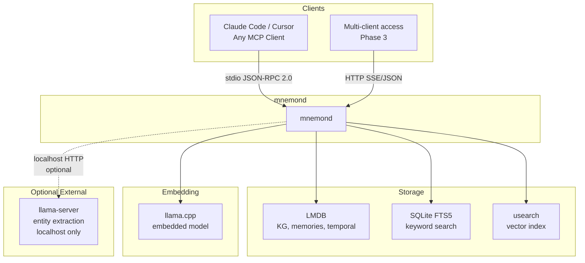
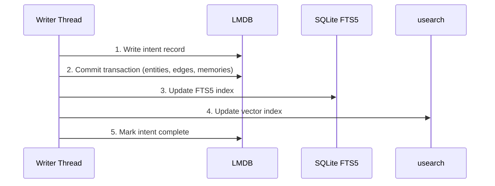
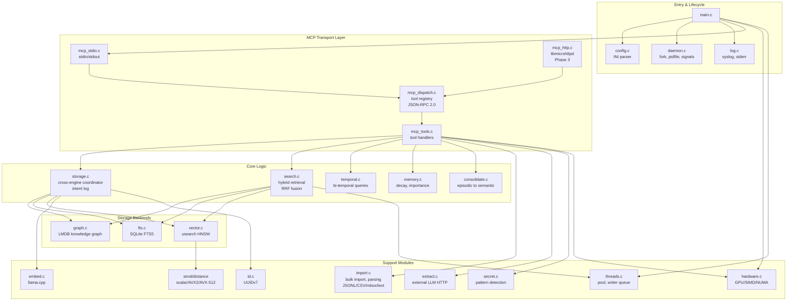
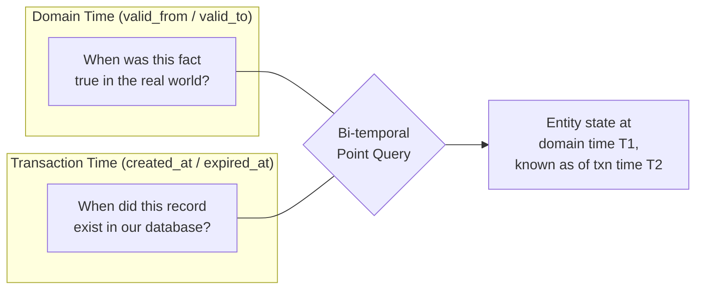
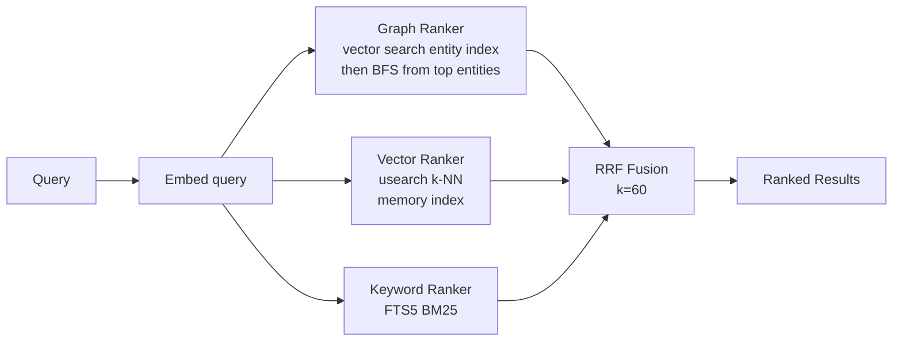
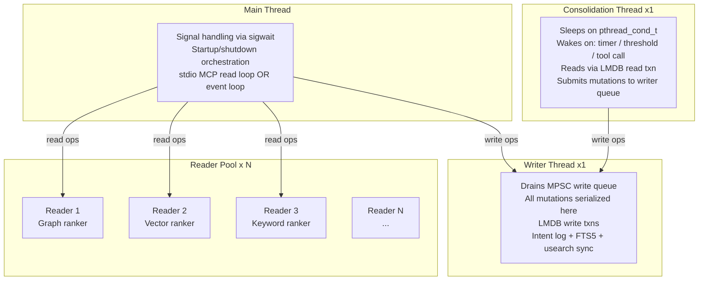
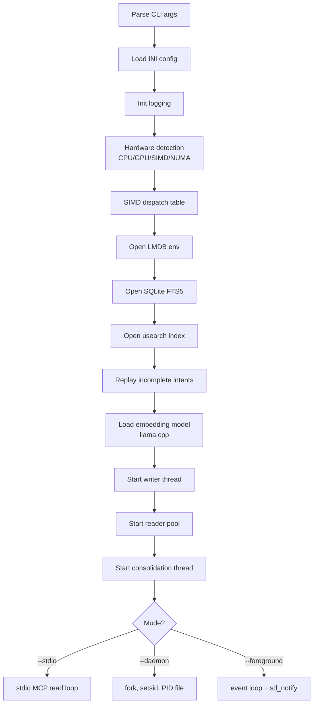
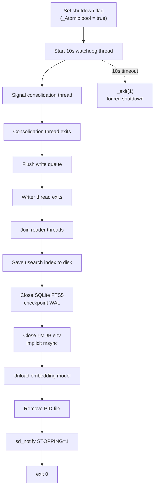
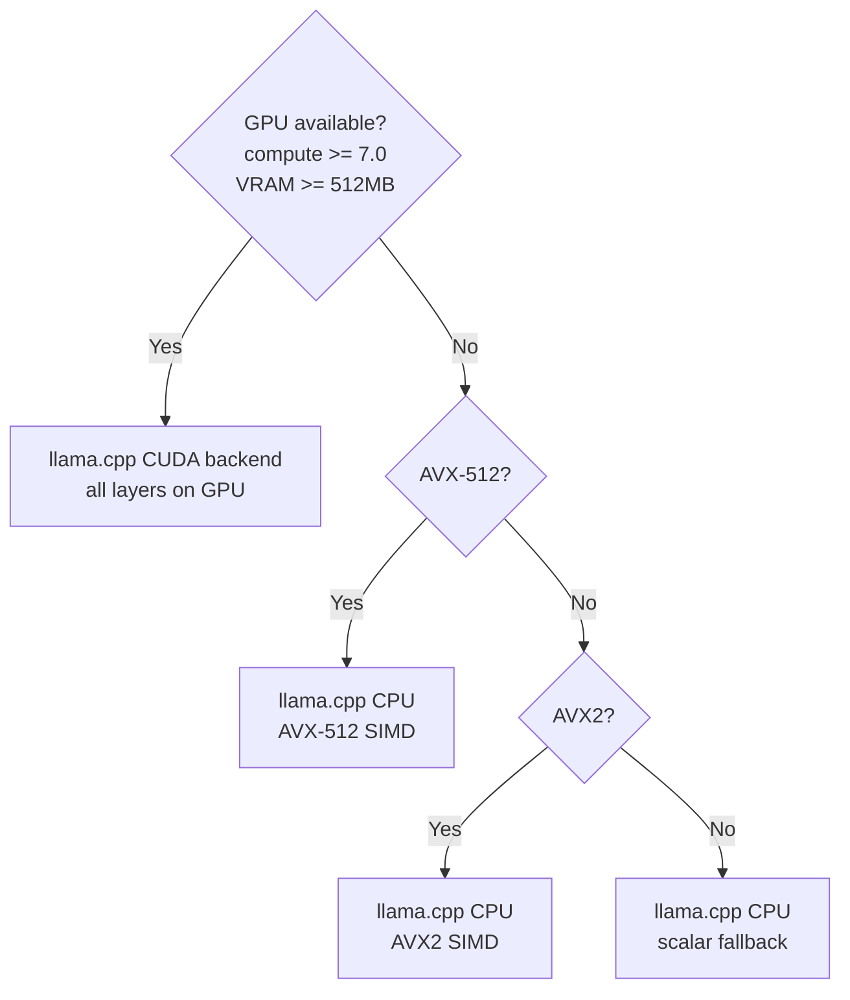

# MnemonAI: Architecture Document

**Version:** 0.4 -- All gaps closed
**Author:** Architecture session (Claude Code)
**Date:** 2026-04-04
**Status:** Reviewed by Gemini 2.5 Pro, OpenAI o3, Grok 3, Mistral Large. Findings addressed. Phase 9 integration complete.
**Prerequisites:** [Research Synthesis](research-synthesis.md), [Landscape Report](memory-mcp-report-v2.md)

---

## Table of Contents

1. [System Overview](#1-system-overview)
2. [Guiding Principles](#2-guiding-principles)
3. [Design Decisions](#3-design-decisions)
4. [Component Architecture](#4-component-architecture)
5. [Data Model](#5-data-model)
6. [MCP Protocol Interface](#6-mcp-protocol-interface)
7. [Concurrency Model](#7-concurrency-model)
8. [Daemon Lifecycle](#8-daemon-lifecycle)
9. [Hardware Detection and Dispatch](#9-hardware-detection-and-dispatch)
10. [Security Model](#10-security-model)
11. [Build System and Dependencies](#11-build-system-and-dependencies)
12. [Configuration](#12-configuration)
13. [Implementation Phases](#13-implementation-phases)
14. [Risk Register](#14-risk-register)
15. [Resolved Design Questions](#15-resolved-design-questions)
16. [Peer Review Response](#16-peer-review-response)
17. [Competitive Comparison](#17-competitive-comparison)

---

## 1. System Overview

MnemonAI is a UNIX daemon written in C that provides persistent, searchable memory to LLM agents via the Model Context Protocol (MCP). It combines a bi-temporal knowledge graph, full-text search, and vector similarity search into a single process with zero cloud dependencies.

### 1.1 System Context Diagram



### 1.2 Key Properties

| Property | Value |
|----------|-------|
| Language | C11 |
| Process model | Single daemon, multi-threaded |
| MCP transports | stdio + Streamable HTTP with TLS + SSE |
| Primary storage | LMDB (mmap, MVCC, ACID) |
| Search backends | SQLite FTS5 (BM25), usearch (HNSW cosine) |
| Embedding | llama.cpp in-process, nomic-embed-text-v1.5 Q8_0 |
| Entity extraction | External LLM via localhost HTTP (optional) |
| Cloud dependency | None |
| GPU dependency | None (opportunistic acceleration) |

---

## 2. Guiding Principles

1. **UNIX philosophy.** The daemon does one thing: memory persistence and retrieval over MCP. It does not run LLM inference for entity extraction. It does not serve a web UI. It does not manage other processes.

2. **Crash-only design.** All persistent state is crash-safe. LMDB provides ACID transactions with mmap. SQLite provides WAL-mode journaling. No custom recovery logic. If the daemon crashes, restart it. The data is intact.

3. **Zero mandatory runtime dependencies.** The daemon starts and serves memories on a machine with no GPU, no CUDA, no network. Hardware acceleration is opportunistic -- detected at startup, used if available, gracefully absent if not.

4. **Layered complexity.** Phase 1 is a working memory server over stdio. Each subsequent phase adds one axis of capability. Never two at once. Each phase produces a usable system.

5. **Data locality.** All data stays on the local filesystem. No DNS resolution, no TLS handshakes, no cloud tokens anywhere in the code. The only outbound network call is to localhost for optional entity extraction.

6. **Source of truth.** LMDB is the authoritative store. FTS5 and usearch are derived indexes that can be rebuilt from LMDB at any time. This simplifies crash recovery and eliminates distributed consistency concerns.

---

## 3. Design Decisions

### 3.1 MCP Protocol Layer

**Decision:** Build the stdio JSON-RPC 2.0 transport from scratch on cJSON. Add libmicrohttpd for streamable HTTP in Phase 3.

**Rationale:**
- The stdio transport is ~500-700 lines of C. The protocol is: read newline-delimited JSON from stdin, write JSON to stdout. No session management, no connection lifecycle, no TLS.
- SupaMCP is early-stage with an unstable API. Adopting it creates coupling to an external abstraction over a trivial protocol.
- cJSON (MIT, 2 files) is the most widely deployed C JSON library. No alternative warrants evaluation.
- For HTTP (Phase 3): libmicrohttpd is GNU LGPL, battle-tested (GNUnet, systemd), callback-driven. It is a library, not a framework.

**Transport abstraction:**
```c
// Both transports produce/consume the same type
typedef struct {
    int (*read_request)(void *ctx, cJSON **out);
    int (*write_response)(void *ctx, const cJSON *response);
    void (*close)(void *ctx);
} mnemon_transport_t;
```
Both transports feed `mcp_dispatch()`. The dispatch layer has no knowledge of transport details.

**Alternatives rejected:**
- SupaMCP: unstable API, unnecessary abstraction for a simple protocol
- gopher-mcp: C++ with C FFI adds build complexity and a C++ runtime dependency
- mcpc: stdio only, no HTTP path forward

### 3.2 Entity Extraction

**Decision:** Entity extraction is performed by calling an external OpenAI-compatible endpoint (e.g., llama-server) over HTTP on localhost. The daemon does NOT embed a generative model. If no endpoint is configured, memories are stored verbatim without entity decomposition.

**Rationale:**
- Entity extraction requires a generative model (3B+ parameters minimum for quality). Embedding this alongside the embedding model would add 2-5GB memory pressure and compete for GPU resources.
- llama-server already handles batching, GPU memory management, and model serving. Duplicating its functionality is waste.
- Making extraction optional means the daemon is useful immediately without it.
- The HTTP call is to 127.0.0.1 only. Latency is sub-millisecond for the network hop; LLM inference dominates.

**Interface:** `store_memory` optionally triggers extraction. The daemon POSTs to `http://127.0.0.1:{port}/v1/chat/completions` with a structured prompt. The response is parsed into entities and relations.

**Atomicity:** If `extract_entities=true` and extraction fails (timeout, endpoint down, malformed response), the entire `store_memory` operation fails with an error. The memory is NOT stored partially. This prevents two classes of memories (with/without entities) and gives the client a clear signal to retry or store without extraction. The LLM response is validated against an expected JSON schema before entity/edge creation -- reject malformed or suspicious field values (e.g., entity names containing SQL metacharacters or control characters).

**Configuration:**
```ini
[extraction]
enabled = false
endpoint = http://127.0.0.1:8080/v1/chat/completions
timeout_ms = 10000
model = ""
```

**Alternatives rejected:**
- Embedded generative model: resource contention, build complexity, VRAM competition
- Rule-based NER: too low quality for knowledge graph construction
- Mandatory extraction: creates a hard dependency on an external service

### 3.3 Embedding Strategy

**Decision:** Link llama.cpp statically. Load nomic-embed-text-v1.5 (Q8_0, 768-dim, ~150MB) directly in the daemon process.

**Rationale:**
- Unlike entity extraction, embedding is a pure forward pass through a small model. No generative decoding, no sampling, no chat templates.
- The llama.cpp C API for embeddings is minimal: `llama_model_load()`, `llama_decode()`, `llama_get_embeddings()`. ~50 lines of integration code.
- In-process embedding eliminates HTTP overhead on the most latency-sensitive path. Every `store_memory` and `search_semantic` call needs embeddings.
- At ~150MB, the embedding model coexists easily with entity extraction on a 24GB GPU. On CPU with AVX2, throughput is ~100-200 embeddings/sec -- adequate for a memory server.

**Model management:** The daemon reads the model from a configured path (default: `$XDG_DATA_HOME/mnemond/models/nomic-embed-text-v1.5.Q8_0.gguf`). If the file does not exist, embedding-dependent tools return an error with instructions. The daemon auto-downloads if libcurl is available.

**Model integrity:** An optional `model_sha256` config field allows verifying the GGUF file at load time. If set and the hash mismatches, the daemon refuses to start. This prevents loading a tampered or corrupted model file.

**Alternatives rejected:**
- External HTTP embedding server: adds latency to every store and search
- ONNX Runtime: larger dependency, less community support for GGUF quantized models
- Multiple model support: unnecessary complexity for Phase 1; nomic-embed-text-v1.5 is the clear winner

### 3.4 Cross-Storage Transaction Coordination

**Decision:** Write-ahead intent log in LMDB coordinates writes across LMDB, SQLite FTS5, and usearch.

**Rationale:**
- True distributed 2PC across three storage engines is complex and fragile. We don't need it because the write path is single-threaded (Section 7).
- LMDB is the source of truth. FTS5 and usearch are derived indexes.

**Write sequence:**



**Intent record structure:**
```c
typedef struct {
    uint8_t  id[16];           // UUIDv7
    uint8_t  op_type;          // STORE, UPDATE, DELETE
    uint8_t  steps_done;       // Bitmask: 0x01=LMDB, 0x02=FTS5, 0x04=usearch
    uint8_t  payload_hash[32]; // SHA-256 of the data written to LMDB
    // ... operation-specific fields
} mnemon_intent_t;
```

The `steps_done` bitmask tracks exactly which sub-steps completed. On crash during replay, the daemon skips already-completed steps rather than re-running from scratch.

**Durability guarantees:**
- After step 3 (FTS5 update): call `sqlite3_wal_checkpoint(db, SQLITE_CHECKPOINT_TRUNCATE)` to force WAL flush before proceeding.
- After step 4 (usearch update): use atomic save pattern: `save(tmp_path) + fsync(fd) + rename(tmp_path, real_path)` to prevent partial writes.
- Only then mark intent complete in step 5.

**Delete path:** Deletions follow the same 5-step sequence. Step 2 sets `expired_at` in LMDB. Step 3 removes the FTS5 entry via `INSERT INTO memory_fts(memory_fts, rowid, ...) VALUES('delete', ...)`. Step 4 removes the vector from usearch. Step 5 marks complete.

**Recovery:** On startup, scan for incomplete intents and replay only the steps not yet marked in `steps_done`. Operations are idempotent (FTS5 insert-or-replace, usearch upsert, FTS5 delete of already-deleted row is a no-op).

**Failure modes:**
| Crash Point | LMDB State | FTS5 State | usearch State | Recovery |
|---|---|---|---|---|
| During step 2 | Uncommitted | Unchanged | Unchanged | Clean, no action |
| After step 2, before step 3 | Committed | Stale | Stale | Replay steps 3-5, bitmask=0x01 |
| After step 3, before step 4 | Committed | Current | Stale | Replay steps 4-5, bitmask=0x03 |
| After step 4, before step 5 | Committed | Current | Current | Mark complete, bitmask=0x07 |
| FTS5 or usearch corruption | Intact | Corrupt | Corrupt | `rebuild_indexes` from LMDB |

**Alternatives rejected:**
- 2PC across engines: complex, fragile, unnecessary given single-writer model
- Eventual consistency without intent log: no way to detect what needs replay
- Single storage engine: no single engine provides KG + FTS + vector search

### 3.5 Consolidation Strategy

**Decision:** Triple trigger: explicit MCP tool call, memory count threshold (default 100), periodic timer (default 1 hour).

**Rationale:**
- Explicit tool call gives the LLM agent direct control ("consolidate memories about project X").
- Count threshold prevents unbounded growth of raw episodic traces.
- Periodic timer catches slow-trickling accumulation.

**Implementation:** Dedicated consolidation thread sleeps on a `pthread_cond_t`. Wakes when: timer fires, threshold crossed, or MCP tool invoked. Consolidation submits writes to the writer queue (Section 7), so it never races with normal writes.

**Consolidation algorithm:**
1. Open a snapshot LMDB read transaction (`MDB_RDONLY`) for a consistent view -- consolidation may miss updates that arrive during processing, which is acceptable
2. Select unconsolidated episodic memories (`consolidated = false`)
3. Cluster by vector similarity (cosine > configurable threshold, default 0.7)
4. Within each cluster, group by entity overlap
5. For each group: merge observations into entity nodes, create/update edges, mark source memories as consolidated
6. Submit mutations to the writer queue in batches of `consolidation_batch_size` (default 50) to avoid blocking all writes for the duration of a large consolidation run

### 3.6 Concurrency Model

**Decision:** Single writer thread + reader thread pool. Detailed in Section 7.

### 3.7 Encryption at Rest

**Decision:** Filesystem-level encryption (dm-crypt/LUKS or fscrypt). No application-level encryption.

**Rationale:**
- LMDB uses mmap. Application-level encryption requires encrypting/decrypting every page on every access, destroying the zero-copy advantage that is LMDB's entire value proposition.
- SQLite supports SQLCipher, but encrypting only FTS5 while LMDB data is plaintext is inconsistent and misleading.
- dm-crypt/LUKS encrypts the block device transparently. fscrypt encrypts per-directory. Both are kernel-level, hardware-accelerated (AES-NI), and impose <5% overhead.
- Documentation will include a setup guide for fscrypt on the data directory.

**Application-level security (separate concern):**
- Secret pattern detection before storage (Section 10)
- Input size limits
- Context budget enforcement on retrieval

**Alternatives rejected:**
- Application-level AES per record: destroys mmap zero-copy, adds key management complexity
- SQLCipher for FTS5 only: inconsistent protection, false sense of security

---

## 4. Component Architecture

### 4.1 Module Map



### 4.2 Module Responsibilities

| Module | Files | Responsibility | Dependencies |
|--------|-------|----------------|-------------|
| **main** | main.c | Entry point, arg parsing, startup/shutdown orchestration | config, daemon, log, all init functions |
| **config** | config.c/h | INI config parsing, defaults, validation | none (standalone) |
| **daemon** | daemon.c/h | fork/setsid, PID file, signal handlers, sd_notify | log, libsystemd (optional) |
| **log** | log.c/h | Structured logging to syslog and/or stderr | none (standalone) |
| **mcp_stdio** | mcp_stdio.c/h | Read JSON-RPC from stdin, write to stdout | cJSON |
| **mcp_http** | mcp_http.c/h | Streamable HTTP transport (Phase 3) | libmicrohttpd, cJSON |
| **mcp_dispatch** | mcp_dispatch.c/h | Tool registry, JSON-RPC 2.0 dispatch, error codes, input validation | cJSON, mcp_tools |
| **mcp_tools** | mcp_tools.c/h | Tool handler implementations | storage, search, temporal, memory, consolidate, extract, secret, hardware |
| **storage** | storage.c/h | Cross-engine write coordinator, intent log | graph, fts, vector, embed, id |
| **graph** | graph.c/h | LMDB-backed knowledge graph: entities, edges, traversal | LMDB |
| **fts** | fts.c/h | SQLite FTS5 wrapper: index, search, BM25 scoring | SQLite3 |
| **vector** | vector.c/h | usearch HNSW wrapper: add, remove, search | usearch, simd/distance |
| **embed** | embed.c/h | llama.cpp embedding model: load, encode text to float[] | llama.cpp |
| **search** | search.c/h | Hybrid retrieval: parallel dispatch to 3 rankers, RRF fusion | graph, fts, vector, threads |
| **temporal** | temporal.c/h | Bi-temporal logic: valid time, transaction time, interval queries | graph (LMDB temporal index) |
| **memory** | memory.c/h | Memory lifecycle: Hebbian importance, decay calculation | none (pure logic) |
| **consolidate** | consolidate.c/h | Episodic-to-semantic consolidation pipeline | storage, embed, search |
| **import** | import.c/h | Bulk import: file parsing (JSONL, CSV, mbox, text/markdown), chunking, directory walking | storage, embed |
| **extract** | extract.c/h | Entity extraction via external LLM HTTP call | libcurl, cJSON |
| **secret** | secret.c/h | FSM-based secret pattern detection, input sanitization | none (standalone) |
| **hardware** | hardware.c/h | GPU/SIMD/NUMA detection, capability struct | dlopen(NVML), cpu_features, /proc |
| **threads** | threads.c/h | Writer queue (MPSC), reader thread pool, lifecycle | pthreads |
| **id** | id.c/h | UUIDv7 generation (RFC 9562) | none (standalone) |
| **simd/distance** | distance_*.c, distance.h | Vector distance functions with runtime SIMD dispatch | cpu_features |

### 4.3 Key Interfaces

#### Error Handling Convention

All public APIs return `mnemon_err_t` (not bare `int`). Error context is propagated through a thread-local error struct:

```c
typedef enum {
    MNEMON_OK = 0,
    MNEMON_ERR_NOT_FOUND,
    MNEMON_ERR_ALREADY_EXISTS,
    MNEMON_ERR_LMDB,            // Wraps MDB_* codes
    MNEMON_ERR_SQLITE,          // Wraps SQLITE_* codes
    MNEMON_ERR_USEARCH,
    MNEMON_ERR_EMBED,           // Embedding model error
    MNEMON_ERR_EXTRACTION,      // External LLM call failed
    MNEMON_ERR_SECRET_DETECTED,
    MNEMON_ERR_INVALID_INPUT,
    MNEMON_ERR_QUEUE_FULL,      // Write queue at capacity
    MNEMON_ERR_SHUTDOWN,        // Daemon is shutting down
    MNEMON_ERR_OOM,             // malloc failed
} mnemon_err_t;

// Thread-local error context
const char *mnemon_err_msg(void);   // Human-readable message for last error
int         mnemon_err_code(void);  // Underlying library error code (MDB_*, SQLITE_*, etc.)
```

#### Memory Ownership Convention

All functions that populate output structs containing pointers (`char*`, `char**`, `float*`) allocate heap memory owned by the caller. Every struct type has a corresponding `_free()` function:

```c
void mnemon_memory_free(mnemon_memory_t *mem);
void mnemon_entity_free(mnemon_entity_t *e);
void mnemon_edge_free(mnemon_edge_t *e);
void mnemon_edge_list_free(mnemon_edge_list_t *list);
void mnemon_result_set_free(mnemon_result_set_t *rs);
void mnemon_version_list_free(mnemon_version_list_t *vl);
```

Callers MUST call these after use. Functions that accept `const` pointers do NOT take ownership.

#### storage.h -- Central Coordinator
```c
typedef struct mnemon_storage mnemon_storage_t;

// Lifecycle
mnemon_err_t mnemon_storage_open(mnemon_storage_t **out, const mnemon_config_t *cfg);
void         mnemon_storage_close(mnemon_storage_t *s);

// Write operations (called from writer thread only)
mnemon_err_t mnemon_store_memory(mnemon_storage_t *s, const mnemon_memory_t *mem);
mnemon_err_t mnemon_update_memory(mnemon_storage_t *s, const char *id, const mnemon_memory_t *mem);
mnemon_err_t mnemon_delete_memory(mnemon_storage_t *s, const char *id);
mnemon_err_t mnemon_store_entity(mnemon_storage_t *s, const mnemon_entity_t *e);
mnemon_err_t mnemon_store_edge(mnemon_storage_t *s, const mnemon_edge_t *e);

// Read operations (called from any reader thread, thread-safe)
mnemon_err_t mnemon_get_memory(mnemon_storage_t *s, const char *id, mnemon_memory_t *out);
mnemon_err_t mnemon_get_entity(mnemon_storage_t *s, const char *id, mnemon_entity_t *out);
mnemon_err_t mnemon_search_hybrid(mnemon_storage_t *s, const mnemon_query_t *q,
                                   mnemon_result_set_t *out);

// Maintenance
mnemon_err_t mnemon_rebuild_indexes(mnemon_storage_t *s, const char *target);
mnemon_err_t mnemon_get_stats(mnemon_storage_t *s, mnemon_stats_t *out);
mnemon_err_t mnemon_replay_intents(mnemon_storage_t *s);
```

#### graph.h -- LMDB Knowledge Graph
```c
typedef struct mnemon_graph mnemon_graph_t;

// Lifecycle
int  mnemon_graph_open(mnemon_graph_t **out, MDB_env *env);
void mnemon_graph_close(mnemon_graph_t *g);

// Entity CRUD (within an LMDB write transaction)
int  mnemon_graph_put_entity(mnemon_graph_t *g, MDB_txn *txn,
                              const mnemon_entity_t *e);
int  mnemon_graph_get_entity(mnemon_graph_t *g, MDB_txn *txn,
                              const char *id, mnemon_entity_t *out);
int  mnemon_graph_del_entity(mnemon_graph_t *g, MDB_txn *txn, const char *id);

// Edge CRUD
int  mnemon_graph_put_edge(mnemon_graph_t *g, MDB_txn *txn,
                            const mnemon_edge_t *e);
int  mnemon_graph_get_edges_from(mnemon_graph_t *g, MDB_txn *txn,
                                  const char *source_id, const char *edge_type,
                                  mnemon_edge_list_t *out);
int  mnemon_graph_get_edges_to(mnemon_graph_t *g, MDB_txn *txn,
                                const char *target_id, const char *edge_type,
                                mnemon_edge_list_t *out);

// Traversal
int  mnemon_graph_bfs(mnemon_graph_t *g, MDB_txn *txn,
                       const char *start_id, int max_depth,
                       mnemon_visit_fn visit, void *user_ctx);

// Temporal queries (read-only)
int  mnemon_graph_get_entity_at(mnemon_graph_t *g, MDB_txn *txn,
                                 const char *id, int64_t timestamp,
                                 mnemon_entity_t *out);
int  mnemon_graph_get_history(mnemon_graph_t *g, MDB_txn *txn,
                               const char *id, int64_t since, int64_t until,
                               mnemon_version_list_t *out);
```

#### search.h -- Hybrid Retrieval
```c
typedef struct {
    const char *query_text;
    float      *query_embedding;    // Pre-computed or NULL (search computes it)
    int         top_k;              // Max results (capped at 50)
    float       min_score;          // Minimum RRF score threshold
    // Filters
    const char *tier_filter;        // NULL = all tiers
    const char *entity_type_filter; // NULL = all types
    int64_t     since;              // 0 = no lower bound
    int64_t     until;              // 0 = no upper bound
} mnemon_query_t;

typedef struct {
    char    id[37];         // UUID string
    char   *content;
    float   score;          // RRF fused score
    float   graph_score;    // Individual ranker score
    float   vector_score;
    float   keyword_score;
    char   *tier;
} mnemon_result_t;

typedef struct {
    mnemon_result_t *results;
    int              count;
    bool             truncated;    // true if more results exist beyond top_k
} mnemon_result_set_t;

int mnemon_search_hybrid(mnemon_storage_t *s, const mnemon_query_t *q,
                          mnemon_result_set_t *out);
int mnemon_search_semantic(mnemon_storage_t *s, const mnemon_query_t *q,
                            mnemon_result_set_t *out);
int mnemon_search_keyword(mnemon_storage_t *s, const mnemon_query_t *q,
                           mnemon_result_set_t *out);
```

#### embed.h -- Embedding Generation
```c
typedef struct mnemon_embed mnemon_embed_t;

int  mnemon_embed_init(mnemon_embed_t **out, const mnemon_config_t *cfg);
void mnemon_embed_free(mnemon_embed_t *e);

// Single text -> embedding
int  mnemon_embed_text(mnemon_embed_t *e, const char *text, size_t text_len,
                        float *out_embedding, int dimensions);

// Batch embedding (for consolidation, bulk import)
int  mnemon_embed_batch(mnemon_embed_t *e, const char **texts, size_t count,
                         float *out_embeddings, int dimensions);

// Query if model is loaded
bool mnemon_embed_available(const mnemon_embed_t *e);
int  mnemon_embed_dimensions(const mnemon_embed_t *e);
```

---

## 5. Data Model

### 5.1 ID Scheme: UUIDv7

All entities, edges, and memories use **UUIDv7** (RFC 9562):
- 48-bit Unix timestamp in milliseconds + 74 bits random
- Time-sortable: natural ordering in LMDB's B-tree, range scans by creation time are free
- Stored as 16 raw bytes in LMDB keys
- Displayed as standard 36-character UUID string in MCP JSON responses

### 5.2 LMDB Database Layout

LMDB supports named databases (sub-databases) within a single environment file. We use seven:

| Database | Key Format | Key Size | Value | Flags | Purpose |
|---|---|---|---|---|---|
| `entities` | `entity_id` | 16 bytes | msgpack entity | 0 | Entity storage |
| `edges` | `source_id \| type_hash \| target_id` | 40 bytes | msgpack edge | `MDB_DUPSORT` | Forward edge index |
| `edges_rev` | `target_id \| type_hash \| source_id` | 40 bytes | `edge_id` (16 bytes) | `MDB_DUPSORT` | Reverse edge index |
| `memories` | `memory_id` | 16 bytes | msgpack memory | 0 | Raw memory storage |
| `temporal` | `entity_id \| valid_from` | 24 bytes | `version_id` (16 bytes) | `MDB_DUPSORT` | Temporal version index |
| `intents` | `intent_id` | 16 bytes | msgpack intent | 0 | Write-ahead intent log |
| `meta` | string key | variable | string value | 0 | Schema version, counters |

**Key encoding rules:**
- All composite keys use fixed-width fields, concatenated without delimiters
- `type_hash` is 8-byte FNV-1a of the edge type string (fixed-width for efficient comparison)
- Keys are compared with LMDB's default lexicographic byte comparison
- `MDB_DUPSORT` on edge databases enables efficient range scans: "all edges from entity X" or "all edges of type Y from entity X"

**Why LMDB:**
- mmap-based: zero-copy reads, OS manages page cache
- MVCC: readers never block writers, writers never block readers
- Single-writer: simplifies our concurrency model (Section 7)
- Crash-safe: copy-on-write B-tree, no WAL, no recovery
- Minimal API surface: ~15 functions for full functionality

### 5.3 Entity Structure

```c
typedef struct mnemon_entity {
    uint8_t     id[16];             // UUIDv7
    char       *name;               // Human-readable label
    char       *entity_type;        // "person", "project", "concept", "tool", etc.
    char      **observations;       // Array of observation strings
    uint32_t    observation_count;
    float       *embedding;          // Heap-allocated 768-float vector (name + observations, for graph ranker seeding)
    int64_t     created_at;         // Transaction time: when record was created (ms)
    int64_t     updated_at;         // Transaction time: when record was last modified (ms)
    float       importance;         // 0.0 - 1.0, Hebbian-adjusted
    uint32_t    access_count;       // Retrieval count for Hebbian strengthening
    int64_t     last_accessed;      // When this entity was last retrieved (ms)
} mnemon_entity_t;
```

Entities carry their own embedding (generated from `name + " " + joined(observations)`). This enables vector-based graph ranker seeding in hybrid search -- the graph ranker finds semantically relevant entities even when query wording doesn't match entity names. Re-embedded on `add_observation`. ~3KB per entity.

### 5.4 Edge Structure (Bi-Temporal)

```c
typedef struct mnemon_edge {
    uint8_t     id[16];             // UUIDv7
    uint8_t     source_id[16];      // Source entity UUIDv7
    uint8_t     target_id[16];      // Target entity UUIDv7
    char       *edge_type;          // "works_on", "knows", "is_a", "part_of", etc.
    char       *description;        // Free-text description of the relationship
    float       weight;             // 0.0 - 1.0 relationship strength

    // Bi-temporal fields (Graphiti model)
    int64_t     valid_from;         // Domain time: when this fact became true
    int64_t     valid_to;           // Domain time: when this fact stopped being true
                                    //   0 = still valid (open-ended)
    int64_t     created_at;         // Transaction time: when this record was inserted
    int64_t     expired_at;         // Transaction time: when this record was superseded
                                    //   0 = current version
} mnemon_edge_t;
```

**Bi-temporal semantics:**



- **Update pattern:** Never overwrite. Set `expired_at` on the old edge, insert a new edge with new `valid_from`/`valid_to` and a fresh `created_at`. Both records persist.
- **Delete pattern:** Set `expired_at` on the edge. It remains queryable for historical analysis.
- **Point-in-time query:** "What did we know about X at domain time T1 and transaction time T2?" filters on both dimensions.

### 5.5 Memory Structure

```c
typedef enum {
    MNEMON_TIER_EPISODIC   = 0,    // Raw experience, conversation fragment
    MNEMON_TIER_SEMANTIC   = 1,    // Extracted/consolidated fact
    MNEMON_TIER_PROCEDURAL = 2,    // How-to knowledge, learned strategies
} mnemon_memory_tier_t;

typedef struct mnemon_memory {
    uint8_t              id[16];            // UUIDv7
    mnemon_memory_tier_t tier;
    char                *content;           // Raw text content
    char                *source_type;       // "mcp", "email", "slack", "transcript",
                                            // "document", "poll", "chat", "note", "import"
    char                *source_id;         // Origin identifier: session ID, message ID,
                                            // filename, channel+timestamp, etc.
    char                *source_author;     // Who created the original content (nullable)
    int64_t              source_timestamp;  // When the original content was created (ms),
                                            //   distinct from created_at (when we stored it)
    char               **tags;              // User-defined tags for filtering
    uint32_t             tag_count;
    float               *embedding;         // Heap-allocated 768-float vector (nomic-embed-text-v1.5)
    float                importance;        // 0.0 - 1.0, subject to decay
    uint32_t             access_count;      // Retrieval count
    int64_t              created_at;        // Transaction time (ms) -- when stored in mnemond
    int64_t              last_accessed;     // Last retrieval time (ms)
    uint8_t            **entity_ids;        // Associated entity UUIDs
    uint32_t             entity_id_count;
    bool                 consolidated;      // Processed by consolidation?
} mnemon_memory_t;
```

### 5.6 Serialization: MessagePack

All LMDB values are serialized as MessagePack (not JSON):
- 2-5x more compact than JSON
- No parsing ambiguity (binary format)
- Minimal C implementation (~200 lines for pack/unpack)
- Compatible with LMDB's zero-copy reads: deserialize directly from mmap'd pages

We hand-roll a minimal msgpack encoder/decoder for our specific structs. No external msgpack library needed -- the format is simple enough that type-specific pack/unpack functions are cleaner than a generic library.

**Schema versioning:** Every serialized record begins with a version byte. The decoder ignores unknown map keys (forward-compatible). On schema change, migration code reads old-version records and writes new-version on next update. The `meta` database stores `schema_version` to detect stale data on startup.

### 5.7 SQLite FTS5 Schema

```sql
-- Contentless FTS5 index: stores only the inverted index, not the source text.
-- Source text lives in LMDB. Avoids data duplication.
CREATE VIRTUAL TABLE memory_fts USING fts5(
    content,          -- memory content text
    name,             -- entity name (for entity indexing)
    entity_type,      -- entity type string
    observations,     -- concatenated observations
    source_type,      -- "email", "slack", "transcript", etc.
    source_author,    -- who created the original content
    tags,             -- space-separated tags for FTS matching
    content='',       -- contentless mode
    content_rowid='rowid',
    tokenize='porter unicode61'   -- Porter stemming + Unicode normalization
);

-- Map FTS5 integer rowids to LMDB UUIDs
CREATE TABLE fts_id_map (
    rowid       INTEGER PRIMARY KEY,
    uuid        BLOB NOT NULL,          -- 16-byte UUIDv7
    source_type INTEGER NOT NULL        -- 0 = memory, 1 = entity
);

CREATE INDEX idx_fts_uuid ON fts_id_map(uuid);
```

**Why contentless:** We don't want text duplicated in both LMDB and SQLite. On a BM25 match, we get the rowid, look up the UUID in `fts_id_map`, and fetch the full record from LMDB.

### 5.8 Vector Index (usearch)

| Property | Value |
|----------|-------|
| Library | usearch (C99 single-header, Apache 2.0) |
| Algorithm | HNSW |
| Dimensions | 768 (nomic-embed-text-v1.5) |
| Metric | Cosine similarity |
| Key type | 64-bit integer |
| Persistence | Native save/load to `vectors.usearch` file |
| Quantization | Scalar (float32 -> int8) for indexes >100K vectors |

**ID mapping:** usearch uses uint64 keys. We use the lower 8 bytes of the UUIDv7 (the random portion) as the usearch key. The full UUID is stored in the LMDB record. On insertion, check if the key already exists in usearch -- if so, regenerate the uint64 from a different hash of the full UUID. This eliminates the (astronomically rare but silent) collision-overwrites-data failure mode.

**Atomic persistence:** usearch's native `save()` truncates then writes, which is not crash-safe. We use the atomic save pattern: `save(tmp_path) + fsync(tmp_fd) + rename(tmp_path, real_path)`. This ensures the index file is either the old version or the new version, never a partial write.

**Dual indexes:** Two separate usearch index files:
- `vectors_memories.usearch` -- memory embeddings (queried by vector ranker in hybrid search)
- `vectors_entities.usearch` -- entity embeddings (queried by graph ranker to find seed nodes)

Both use the same dimensions (768), metric (cosine), and ID mapping scheme. The entity index is much smaller (entities << memories) and fits comfortably in memory. The graph ranker queries the entity index to find the top-K most semantically relevant entities, then runs BFS from those nodes. This makes the graph ranker robust to paraphrasing and keeps all three rankers independent and parallel.

---

## 6. MCP Protocol Interface

### 6.1 JSON-RPC 2.0 Conventions

- Request/response over stdio (newline-delimited JSON)
- MCP protocol version: 2024-11-05 (latest stable)
- All tools return results wrapped in MCP `content` blocks
- Errors use standard JSON-RPC error codes + MCP-specific codes

### 6.2 Tool Registry

Tools are registered in `mcp_dispatch.c` with their JSON Schema input definitions. The `tools/list` MCP method returns the full registry.

### 6.3 Tool Definitions (28 tools)

#### 6.3.1 Memory CRUD (4 tools)

**`store_memory`**
| Parameter | Type | Required | Default | Description |
|-----------|------|----------|---------|-------------|
| content | string | yes | | Text content to store |
| source_type | string | no | "mcp" | Origin type: "mcp", "email", "slack", "transcript", "document", "poll", "chat", "note", "import" |
| source_id | string | no | "" | Origin identifier (session ID, message ID, filename, channel+ts, etc.) |
| source_author | string | no | null | Who created the original content |
| source_timestamp | string | no | null | ISO 8601 when the original content was created (distinct from storage time) |
| tags | string[] | no | [] | User-defined tags for filtering and organization |
| tier | string | no | "episodic" | One of: episodic, semantic, procedural |
| extract_entities | bool | no | false | Trigger entity extraction (requires configured endpoint) |
| skip_secret_check | bool | no | false | Skip FSM secret detection (logged at WARN) |

Returns: `{id, tier, entity_ids[], tags[], source_type, created_at}`

Behavior: Generates embedding via llama.cpp, checks for secret patterns (unless skipped), stores in LMDB + FTS5 + usearch. If `extract_entities` is true and endpoint is configured, calls external LLM for entity/relation extraction.

**`retrieve_memory`**
| Parameter | Type | Required | Description |
|-----------|------|----------|-------------|
| id | string | yes | Memory UUID |

Returns: Full memory object. Updates `access_count` and `last_accessed` (Hebbian strengthening).

**`update_memory`**
| Parameter | Type | Required | Description |
|-----------|------|----------|-------------|
| id | string | yes | Memory UUID |
| content | string | no | Updated text (re-embeds if changed) |
| observations | string[] | no | Additional observations to append |

Returns: Updated memory object. Creates a new temporal version; does not overwrite.

**`delete_memory`**
| Parameter | Type | Required | Description |
|-----------|------|----------|-------------|
| id | string | yes | Memory UUID |

Returns: `{deleted: true}`. Soft delete: sets `expired_at`, removes from FTS5 and usearch, but LMDB record persists for audit.

#### 6.3.2 Search (4 tools)

**`search_hybrid`** -- Primary search tool



| Parameter | Type | Required | Default | Description |
|-----------|------|----------|---------|-------------|
| query | string | yes | | Natural language query |
| top_k | int | no | 10 | Max results (hard max: 50) |
| min_score | float | no | 0.0 | Minimum RRF score |
| tier | string | no | null | Filter by tier |
| entity_type | string | no | null | Filter by entity type |
| source_type | string | no | null | Filter by source type (e.g., "email", "slack") |
| tags | string[] | no | null | Filter by tags (AND logic -- all tags must match) |
| since | string | no | null | ISO 8601 lower bound |
| until | string | no | null | ISO 8601 upper bound |

Returns: `{results: [{id, content, score, graph_score, vector_score, keyword_score, tier, entities[]}], truncated}`

Behavior: Dispatches query to all three rankers in parallel (graph context, vector similarity, BM25 keyword). Each ranker's raw scores are min-max normalized to [0,1] within its own result set before rank assignment. Results are fused via Reciprocal Rank Fusion (RRF, k=60). If a ranker returns zero results (e.g., graph ranker with no entity matches), it is excluded from fusion rather than contributing empty ranks. Updates access counts on returned memories.

**`search_semantic`** -- Vector-only search
Parameters: `query` (string), `top_k` (int, default 10)
Returns: Ranked results by cosine similarity.

**`search_keyword`** -- BM25-only search
Parameters: `query` (string), `top_k` (int, default 10)
Returns: BM25-ranked results from FTS5.

**`search_temporal`** -- Time-filtered search
Parameters: `entity_id` (string, optional), `since` (ISO 8601), `until` (ISO 8601), `top_k` (int, default 10)
Returns: Memories/entities within the time range, ordered by timestamp.

#### 6.3.3 Entity / Graph (5 tools)

**`create_entity`**
Parameters: `name` (string), `entity_type` (string), `observations` (string[], optional)
Returns: Entity object with UUID.

**`add_observation`**
Parameters: `entity_id` (string), `observation` (string)
Returns: Updated entity with new observation appended. Re-indexes in FTS5.

**`create_relation`**
Parameters: `source_id` (string), `target_id` (string), `edge_type` (string), `description` (string, optional), `valid_from` (ISO 8601, optional, default now)
Returns: Edge object with UUID. Bi-temporal: `valid_from` defaults to current time, `valid_to` is open.

**`search_entities`**
Parameters: `query` (string), `entity_type` (string, optional), `top_k` (int, default 10)
Returns: Ranked entity list via hybrid search over entity names + observations.

**`get_entity_graph`**
Parameters: `entity_id` (string), `depth` (int, default 2, max 5)
Returns: `{entity, edges_out[], edges_in[], related_entities[]}`. BFS traversal, capped at 100 total nodes.

#### 6.3.4 Temporal (3 tools)

**`get_history`**
Parameters: `entity_id` (string), `since` (ISO 8601, optional), `until` (ISO 8601, optional)
Returns: List of temporal versions with valid times.

**`get_state_at_time`**
Parameters: `entity_id` (string), `timestamp` (ISO 8601)
Returns: Entity state as it was known at that point in time. Bi-temporal point query.

**`get_changes_since`**
Parameters: `since` (ISO 8601), `entity_type` (string, optional), `top_k` (int, default 50)
Returns: Change feed of creates, updates, and deletes.

#### 6.3.5 Maintenance (4 tools)

**`consolidate_memories`**
Parameters: `topic` (string, optional), `entity_id` (string, optional), `dry_run` (bool, default false)
Returns: `{consolidated_count, new_entities[], new_relations[], duration_ms}`

**`prune_stale`**
Parameters: `min_age_days` (int, default 90), `min_importance` (float, default 0.1), `dry_run` (bool, default true)
Returns: `{candidates: [{id, content_preview, importance, last_accessed, age_days}]}`
Note: Defaults to dry_run=true for safety.

**`get_memory_stats`**
Parameters: none
Returns: `{total_memories, by_tier: {episodic, semantic, procedural}, total_entities, total_edges, storage_bytes, uptime_sec}`

**`rebuild_indexes`**
Parameters: `target` (string, optional: "fts", "vector", "all", default "all")
Returns: `{rebuilt: [targets], duration_ms}`
Note: Rebuilds FTS5 and/or usearch from LMDB source of truth.

#### 6.3.6 System (3 tools)

**`health_check`**
Parameters: none
Returns: `{status: "ok"|"degraded", uptime_sec, storage_ok, embedding_model_loaded, extraction_available, version}`

**`get_hardware_info`**
Parameters: none
Returns: `{cpu: {model, cores, simd_caps[]}, gpu: {model, vram_mb, compute_capability}, ram_mb, numa_nodes, storage_type}`

**`get_index_stats`**
Parameters: none
Returns: `{lmdb: {map_size_mb, used_mb, entity_count, edge_count, memory_count}, fts5: {indexed_docs}, vector: {vectors, dimensions, memory_mb}}`

#### 6.3.7 Bulk Import (5 tools)

These tools support ingesting memories from external sources -- not just agent interactions. The daemon is a personal memory store for all knowledge, not just MCP conversations.

**`import_batch`**
| Parameter | Type | Required | Default | Description |
|-----------|------|----------|---------|-------------|
| memories | object[] | yes | | Array of memory objects (same schema as `store_memory` params) |
| extract_entities | bool | no | false | Trigger entity extraction for each memory |
| on_error | string | no | "skip" | "skip" = log and continue, "abort" = fail entire batch |

Returns: `{imported: N, skipped: N, errors: [{index, error}], duration_ms}`

Behavior: Accepts up to 1000 memories per call. Each memory is embedded, secret-checked, and stored. Embeddings are batched for throughput (uses `mnemon_embed_batch()`). Writes are submitted to the writer queue in batches of 50 to avoid blocking other operations. Designed for programmatic use from import scripts.

**`import_file`**
| Parameter | Type | Required | Default | Description |
|-----------|------|----------|---------|-------------|
| path | string | yes | | Absolute path to file on local filesystem |
| format | string | yes | | One of: "jsonl", "csv", "mbox", "text", "markdown" |
| source_type | string | no | "import" | Applied to all imported memories |
| tags | string[] | no | [] | Applied to all imported memories |
| chunking | string | no | "paragraph" | How to split content: "paragraph", "message", "line", "page", "none" |
| max_chunk_size | int | no | 4096 | Max characters per chunk (content exceeding this is split) |
| extract_entities | bool | no | false | Trigger entity extraction per chunk |

Returns: `{imported: N, skipped: N, chunks_created: N, errors: [{chunk, error}], duration_ms}`

Behavior: Reads and parses the file locally (no network). Splits content into memories according to `chunking` strategy. Each chunk gets its own embedding. The `path` must be within allowed import directories (configurable, default `$HOME`). The daemon refuses to read paths outside allowed directories.

**Format details:**
- **jsonl**: One JSON object per line, fields map to `store_memory` params
- **csv**: Header row with columns mapping to `store_memory` params. `content` column required.
- **mbox**: Standard RFC 5322 mailbox. Each message becomes a memory. `source_type` set to "email", `source_author` from `From:`, `source_timestamp` from `Date:`, `source_id` from `Message-ID:`
- **text/markdown**: Plain text split by `chunking` strategy. Source metadata applied uniformly.

**`import_directory`**
| Parameter | Type | Required | Default | Description |
|-----------|------|----------|---------|-------------|
| path | string | yes | | Absolute path to directory |
| pattern | string | no | "*" | Glob pattern for file selection (e.g., "*.md", "*.txt") |
| recursive | bool | no | false | Recurse into subdirectories |
| format | string | no | "auto" | "auto" detects from extension, or force a specific format |
| source_type | string | no | "document" | Applied to all imported memories |
| tags | string[] | no | [] | Applied to all imported memories |
| chunking | string | no | "paragraph" | Chunking strategy |
| extract_entities | bool | no | false | Trigger entity extraction |

Returns: `{files_processed: N, files_skipped: N, memories_imported: N, errors: [{file, error}], duration_ms}`

Behavior: Walks the directory, applies `import_file` to each matching file. Reports per-file results. Runs in the background -- returns immediately with a job ID if the directory is large. Progress queryable via `get_import_status`.

**`get_import_status`**
| Parameter | Type | Required | Description |
|-----------|------|----------|-------------|
| job_id | string | no | Specific job ID. If omitted, returns all active/recent jobs. |

Returns: `{jobs: [{id, status: "running"|"complete"|"failed", files_total, files_done, memories_imported, errors, started_at, duration_ms}]}`

**`list_memories`**
| Parameter | Type | Required | Default | Description |
|-----------|------|----------|---------|-------------|
| source_type | string | no | null | Filter by source type |
| tags | string[] | no | null | Filter by tags |
| since | string | no | null | ISO 8601, filter by source_timestamp |
| until | string | no | null | ISO 8601, filter by source_timestamp |
| tier | string | no | null | Filter by tier |
| offset | int | no | 0 | Pagination offset |
| limit | int | no | 50 | Max results (hard max: 200) |

Returns: `{memories: [{id, content_preview, source_type, source_id, source_author, source_timestamp, tags[], tier, importance, created_at}], total_count, truncated}`

Behavior: Paginated listing of memories with filtering. Unlike `search_*` tools which rank by relevance, this is a structured browse/filter interface. Ordered by `source_timestamp` descending (most recent first). Content is truncated to 200 characters in `content_preview`.

### 6.4 Context Budget Enforcement

Per OWASP MCP03 (Tool Poisoning / Excessive Context):
- All search tools enforce `top_k` with hard maximum of 50
- `get_entity_graph` caps at depth=5, total nodes=100
- All list responses include `truncated: bool`
- `content` fields in results are truncated to `max_memory_size_kb` config value
- Total response size is capped (configurable, default 128KB)

---

## 7. Concurrency Model

### 7.1 Thread Architecture



### 7.2 Why Single Writer

LMDB is fundamentally single-writer. Only one write transaction can be active at a time. Attempting concurrent writes causes the second writer to block on a mutex inside LMDB.

Rather than fighting this with fine-grained locking, we embrace it:
- One writer thread, one write queue, one LMDB write transaction at a time
- All mutations are serialized: store, update, delete, consolidate, prune
- This eliminates all write-side concurrency bugs by design
- Write throughput is not a bottleneck: a memory server ingests at conversation speed (~1-10 writes/sec), and LMDB handles thousands of writes/sec

### 7.3 Reader Thread Pool

Hybrid search benefits from parallelism:
1. Graph ranker: BFS traversal from entities mentioned in the query
2. Vector ranker: usearch k-NN search
3. Keyword ranker: SQLite FTS5 BM25 query

These three rankers are independent and run in parallel on reader threads. The requesting thread dispatches three tasks, waits on a barrier (or three condition variables), then fuses results via RRF.

Each reader thread opens a per-request LMDB read transaction, committed (or aborted) when the request completes. This prevents long-lived read transactions from pinning the LMDB freelist and causing unbounded database growth. The overhead of `mdb_txn_begin(MDB_RDONLY)` is negligible (<1us). On startup, `mdb_env_reader_check()` is called to clean up stale reader slots from prior crashes.

**SQLite FTS5 threading:** Each reader thread opens its own `sqlite3*` connection to the FTS5 database. SQLite in WAL mode supports concurrent readers with separate connections. The writer thread has its own dedicated connection. `PRAGMA wal_autocheckpoint = 1000` limits WAL growth. The writer explicitly checkpoints (`SQLITE_CHECKPOINT_TRUNCATE`) as part of the intent log completion step.

**usearch threading:** usearch does not guarantee thread safety for concurrent read+write. All usearch mutations (`add`, `remove`, `save`) are serialized through the writer thread. usearch searches are guarded by a `pthread_rwlock_t`: the writer takes a write lock during mutations, readers take a read lock during search. This adds minimal overhead (<1us per lock) and prevents undefined behavior.

### 7.4 Synchronization Primitives

| Primitive | Use | Notes |
|-----------|-----|-------|
| `pthread_mutex_t` + `pthread_cond_t` | Write queue (MPSC) | Simple, correct. Upgrade to lock-free if profiling shows contention. |
| `pthread_mutex_t` + `pthread_cond_t` | Reader pool task dispatch | |
| `pthread_mutex_t` + `pthread_cond_t` | Hybrid search synchronization | Wait for all 3 rankers (portable; `pthread_barrier_t` is optional POSIX and missing from musl) |
| `pthread_rwlock_t` | usearch index access | Writer takes write lock for mutations, readers take read lock for search |
| `_Atomic bool` | Shutdown flag | Lock-free, checked in all loops |
| `_Atomic uint64_t` | Stats counters | Lock-free increment for metrics |

### 7.5 Backpressure

The write queue has a configurable maximum depth (default 1024). If the queue is full, the MCP tool handler returns `MNEMON_ERR_QUEUE_FULL` immediately, which maps to JSON-RPC error `{code: -32000, message: "Server busy, write queue full"}`. The client can retry with backoff. No indefinite blocking -- a stdio client hanging on a blocked write is unacceptable.

---

## 8. Daemon Lifecycle

### 8.1 Startup Sequence



**CLI arguments:**
- `--config <path>` -- Config file (default: ~/.config/mnemond/mnemond.conf)
- `--stdio` -- Run in foreground, MCP over stdin/stdout
- `--daemon` -- Daemonize (fork, setsid)
- `--foreground` -- Run in foreground without stdio (for systemd Type=notify)
- `--rebuild-indexes` -- Rebuild FTS5 and usearch from LMDB, then exit
- `--version` -- Print version and exit
- `--check-config` -- Validate config and exit
- `--no-gpu` -- Skip GPU detection and dlopen (for hardened/seccomp environments)

### 8.2 Shutdown Sequence

Triggered by SIGTERM, SIGINT, or fatal condition. A watchdog thread enforces a 10-second timeout -- if graceful shutdown stalls (e.g., llama.cpp holding a lock, MHD connection draining), the process calls `_exit()`.



### 8.3 Signal Handling

| Signal | Action |
|--------|--------|
| SIGTERM (1st) | Graceful shutdown: set `g_shutdown` flag, interrupt blocking I/O |
| SIGTERM (3rd) | Immediate `_exit(128 + sig)` -- emergency escape |
| SIGINT | Same as SIGTERM |
| SIGHUP | Reload configuration (re-read INI file, apply safe changes: log level, consolidation params, decay params. Does NOT change data_dir or reopen storage.) |
| SIGUSR1 | Dump stats to log at INFO level |
| SIGPIPE | Ignored (SIG_IGN) -- stdio write failures handled at application level |
| SIGKILL | Kernel kills immediately (always works, not catchable) |

**Implementation:** Signal handlers use `sigaction()` with `SA_RESTART` deliberately **not** set. This ensures blocking calls (`fgetc`, `pause`, `read`) return `EINTR` when a signal arrives, allowing the main loop to check `g_shutdown` and exit promptly. A detached watchdog thread starts on shutdown and calls `_exit()` after 10 seconds if graceful teardown stalls.

### 8.4 systemd Unit File

```ini
[Unit]
Description=mnemond Memory MCP Server
Documentation=man:mnemond(1)
After=local-fs.target

[Service]
Type=notify
ExecStart=/usr/local/bin/mnemond --foreground
ExecReload=/bin/kill -HUP $MAINPID
Restart=on-failure
RestartSec=5
WatchdogSec=30

# Identity
User=mnemond
Group=mnemond

# Filesystem
StateDirectory=mnemond
RuntimeDirectory=mnemond
ReadWritePaths=/var/lib/mnemond
ProtectSystem=strict
ProtectHome=yes
PrivateTmp=yes

# Security hardening
NoNewPrivileges=yes
ProtectKernelTunables=yes
ProtectControlGroups=yes
RestrictRealtime=yes
ProtectClock=yes
ProtectKernelLogs=yes
MemoryDenyWriteExecute=yes     # Default secure; set to 'no' only if llama.cpp CUDA/JIT requires W+X pages
SystemCallFilter=@system-service @io-event

[Install]
WantedBy=multi-user.target
```

### 8.5 stdio MCP Mode

For direct use with Claude Code / Cursor:
```bash
mnemond --stdio --config ~/.config/mnemond/mnemond.conf
```

No daemonization. MCP read loop on main thread. stderr for logging. This is the Phase 1 primary mode and the expected MCP client configuration:

```json
{
  "mcpServers": {
    "mnemond": {
      "command": "mnemond",
      "args": ["--stdio", "--config", "/home/user/.config/mnemond/mnemond.conf"]
    }
  }
}
```

---

## 9. Hardware Detection and Dispatch

### 9.1 Detection Sequence

All detection runs once at startup. Results are stored in an immutable struct:

```c
typedef struct {
    // CPU
    char     cpu_model[128];
    int      cpu_cores;
    bool     has_avx2;
    bool     has_avx512f;
    bool     has_avx512bw;
    bool     has_avx512vnni;
    bool     has_amx;

    // GPU
    bool     has_nvidia_gpu;
    char     gpu_model[128];
    uint64_t gpu_vram_bytes;
    int      gpu_compute_capability;    // e.g., 89 for SM_89

    // Memory
    uint64_t ram_total_bytes;
    uint64_t ram_available_bytes;
    int      numa_nodes;

    // Storage
    bool     has_nvme;
} mnemon_hardware_t;

extern const mnemon_hardware_t *g_hardware;  // Set once, read-only
```

### 9.2 GPU Detection

NVIDIA GPU detection via dlopen (no compile-time CUDA dependency):

```c
// Pseudocode
void *nvml = dlopen("libnvidia-ml.so.1", RTLD_LAZY);
if (!nvml) { caps->has_nvidia_gpu = false; return; }

// Resolve function pointers
nvmlInit_t nvmlInit = dlsym(nvml, "nvmlInit_v2");
// ... resolve nvmlDeviceGetCount, nvmlDeviceGetName, nvmlDeviceGetMemoryInfo

nvmlInit();
unsigned int count;
nvmlDeviceGetCount(&count);
if (count > 0) {
    // Query first GPU (primary)
    nvmlDeviceGetName(device, caps->gpu_model, sizeof(caps->gpu_model));
    nvmlMemory_t mem;
    nvmlDeviceGetMemoryInfo(device, &mem);
    caps->gpu_vram_bytes = mem.total;
}
nvmlShutdown();
dlclose(nvml);
```

This pattern means the daemon binary runs on any Linux system. GPU support is detected and used at runtime without requiring CUDA at compile time.

### 9.3 SIMD Dispatch

Each SIMD level is compiled in its own translation unit with the appropriate `-m` flag:

```
simd/distance_scalar.c    -> compiled with default flags
simd/distance_avx2.c      -> compiled with -mavx2 -mfma
simd/distance_avx512.c    -> compiled with -mavx512f -mavx512bw
```

At startup, `mnemon_simd_init()` populates a function pointer table:

```c
typedef struct {
    float (*cosine_similarity)(const float *a, const float *b, size_t n);
    float (*l2_distance)(const float *a, const float *b, size_t n);
    void  (*normalize)(float *v, size_t n);
    float (*dot_product)(const float *a, const float *b, size_t n);
} mnemon_simd_ops_t;

extern mnemon_simd_ops_t g_simd_ops;

void mnemon_simd_init(void) {
    if (g_hardware->has_avx512f) {
        g_simd_ops = (mnemon_simd_ops_t){
            .cosine_similarity = cosine_similarity_avx512,
            .l2_distance       = l2_distance_avx512,
            // ...
        };
    } else if (g_hardware->has_avx2) {
        g_simd_ops = (mnemon_simd_ops_t){
            .cosine_similarity = cosine_similarity_avx2,
            // ...
        };
    } else {
        g_simd_ops = (mnemon_simd_ops_t){
            .cosine_similarity = cosine_similarity_scalar,
            // ...
        };
    }
}
```

### 9.4 Embedding Strategy Selection



The `embed.c` module configures `llama_model_params` based on `g_hardware` at model load time. This is a one-time decision at startup.

---

## 10. Security Model

### 10.1 Threat Surface

MnemonAI's threat surface is narrow by design:

| Surface | Exposure | Mitigation |
|---------|----------|------------|
| stdin (MCP) | Local process only | Input validation, size limits |
| HTTP (Phase 3) | Bound to 127.0.0.1 by default | Config-controlled bind address. Static Bearer token required. Refuses to start if bind != 127.0.0.1 and no auth_token is configured. |
| Filesystem | Data directory | UNIX permissions, optional fscrypt |
| GPU (NVML) | Local device | dlopen'd, read-only queries |
| Extraction endpoint | localhost HTTP | Config-controlled, timeout, no auth tokens stored |

### 10.2 OWASP MCP Top 10 Mitigations

| OWASP ID | Threat | Mitigation |
|----------|--------|------------|
| MCP01 | Sensitive data in tools | FSM-based secret pattern detection before storage (API keys, JWTs, private keys, passwords). Single-pass, O(n). Reject with error identifying the pattern type. |
| MCP02 | Tool injection | Input validation against JSON Schema for all tool parameters. No shell execution. No eval. |
| MCP03 | Tool poisoning / excessive context | Hard `top_k` cap (50), graph depth cap (5), node cap (100), response size cap (128KB). `truncated` flag in all list responses. |
| MCP04 | Excessive permissions | Daemon runs as dedicated `mnemond` user. systemd hardening (NoNewPrivileges, ProtectSystem=strict). |
| MCP05 | Insecure storage | Filesystem-level encryption (fscrypt/LUKS). UNIX permissions on data directory (0700). |

### 10.3 Secret Detection

`secret.c` uses a hand-built finite state machine (FSM) for secret pattern detection. No regex engine -- the FSM processes input in a single pass, touching each byte exactly once, for O(n) detection with minimal branch misprediction.

**Design:**
- Each secret pattern is compiled into a set of FSM states at build time (or daemon init)
- Multiple pattern FSMs run in parallel over the same byte stream (interleaved, single pass)
- State transitions are driven by character class lookup tables (256-entry, one per byte value)
- On match, the FSM records the pattern type and byte offset

**Pattern templates (compiled to FSM states):**

| Pattern | Trigger Sequence | Validation |
|---------|-----------------|------------|
| GitHub tokens | `gh` + `[phosr]` + `_` | 36+ alphanumeric chars after `_` |
| OpenAI keys | `sk-` | 32+ alphanumeric chars after `-` |
| AWS access keys | `AKIA` or `ABIA` or `ACCA` or `ASIA` | 16 uppercase alphanumeric chars |
| Private keys | `-----BEGIN ` + optional `RSA \|EC \|DSA ` + `PRIVATE KEY-----` | Literal match |
| JWTs | `eyJ` + 10+ base64url + `.` + 10+ base64url | Two dot-separated base64url segments |
| API key assignments | `api` + optional `[_-]` + `key` + `[:=]` | 20+ alphanumeric chars after delimiter |
| Password assignments | `password` or `passwd` or `pwd` + `[:=]` | 8+ non-whitespace chars after delimiter |

**Performance characteristics:**
- Single pass over input: O(n) where n = content length
- No backtracking (DFA, not NFA)
- Character class tables fit in L1 cache (~2KB total)
- Expected throughput: >1GB/sec on modern hardware (memory-bandwidth bound)

**Why not regex:**
- POSIX `regex.h` is slow (NFA-based, backtracking) and lacks features (no lookahead in ERE)
- PCRE2 is a large dependency for a narrow use case
- Our pattern set is small and fixed -- a hand-built FSM is simpler, faster, and has zero dependencies

**Entropy-based detection:** In addition to pattern matching, strings longer than 32 characters with Shannon entropy > 4.5 bits/char are flagged as potential high-entropy secrets (e.g., randomly generated tokens that don't match known prefixes).

**False positive handling:** The `store_memory` tool accepts a `skip_secret_check` boolean parameter (default false). When true, the FSM scan is skipped. Usage of this flag is logged at WARN level for audit purposes.

**Read-path scanning:** Secrets stored before detection was enabled (or via `skip_secret_check`) can still be returned in search results. The FSM also runs on the read path -- search results that match secret patterns have the matched substring redacted with `[REDACTED]` in the response. The original content in LMDB is not modified.

If a match is found on write, `store_memory` returns an error:
```json
{
    "error": {
        "code": -32001,
        "message": "Memory content contains a potential secret (pattern: github_token). Redact before storing, or set skip_secret_check=true."
    }
}
```

### 10.4 Input Validation

All MCP tool parameters are validated against JSON Schema before the handler is invoked:
- String length limits (content: `max_memory_size_kb`, names: 256 chars)
- Integer range checks (top_k: 1-50, depth: 1-5)
- UUID format validation (reject malformed IDs before LMDB lookup)
- ISO 8601 timestamp parsing with rejection of invalid dates
- No path traversal in any parameter (data directory is hardcoded from config)
- **FTS5 query sanitization:** User query strings are escaped before passing to FTS5. All FTS5 special operators (`NEAR`, `OR`, `AND`, `NOT`, `*`, `"`, `(`, `)`, `^`) are quoted or stripped. This prevents FTS5 injection attacks that could craft expensive queries for DoS.

---

## 11. Build System and Dependencies

> **Implementation note (2026-04-04):** The build system described below is fully implemented and tested. Key additions from the original design: C++ added to LANGUAGES for vendored usearch, SQLite3 amalgamation vendored (eliminates system dependency), `_POSIX_C_SOURCE=200809L` and `_DEFAULT_SOURCE` added globally (required for `strdup`/`realpath`/`clock_gettime` under strict C11), `-Werror=implicit-function-declaration` added to prevent pointer truncation bugs on 64-bit systems.

### 11.1 CMake

```cmake
cmake_minimum_required(VERSION 3.16)
project(mnemond VERSION 0.4.0 LANGUAGES C CXX)  # CXX for vendored usearch only

set(CMAKE_C_STANDARD 11)
set(CMAKE_C_STANDARD_REQUIRED ON)

# --- Vendored dependencies ---
add_subdirectory(third_party/cJSON)
add_subdirectory(third_party/lmdb)
# usearch is header-only, include path only

# --- Required system dependencies ---
find_package(SQLite3 REQUIRED)
find_package(llama REQUIRED)    # llama.cpp via cmake config or pkg-config

# --- Optional system dependencies ---
find_package(PkgConfig)
pkg_check_modules(SYSTEMD libsystemd)
pkg_check_modules(NUMA numa)
find_library(LIBCURL curl)

# --- SIMD compilation ---
include(CheckCCompilerFlag)

add_library(simd_scalar OBJECT simd/distance_scalar.c)

check_c_compiler_flag("-mavx2" HAS_AVX2)
if(HAS_AVX2)
    add_library(simd_avx2 OBJECT simd/distance_avx2.c)
    target_compile_options(simd_avx2 PRIVATE -mavx2 -mfma)
    target_compile_definitions(simd_avx2 PRIVATE MNEMON_HAS_AVX2)
endif()

check_c_compiler_flag("-mavx512f" HAS_AVX512)
if(HAS_AVX512)
    add_library(simd_avx512 OBJECT simd/distance_avx512.c)
    target_compile_options(simd_avx512 PRIVATE -mavx512f -mavx512bw)
    target_compile_definitions(simd_avx512 PRIVATE MNEMON_HAS_AVX512)
endif()

# --- Main executable ---
add_executable(mnemond
    src/main.c src/config.c src/daemon.c src/log.c src/id.c
    src/mcp_stdio.c src/mcp_dispatch.c src/mcp_tools.c
    src/storage.c src/graph.c src/fts.c src/vector.c
    src/embed.c src/search.c src/temporal.c
    src/memory.c src/consolidate.c src/import.c src/extract.c
    src/secret.c src/hardware.c src/threads.c
)

target_link_libraries(mnemond PRIVATE
    cjson lmdb SQLite::SQLite3 llama
    simd_scalar
    $<$<BOOL:${HAS_AVX2}>:simd_avx2>
    $<$<BOOL:${HAS_AVX512}>:simd_avx512>
    $<$<BOOL:${SYSTEMD_FOUND}>:${SYSTEMD_LIBRARIES}>
    $<$<BOOL:${NUMA_FOUND}>:${NUMA_LIBRARIES}>
    $<$<BOOL:${LIBCURL}>:curl>
    pthread m dl
)

# --- Conditional defines ---
if(SYSTEMD_FOUND)
    target_compile_definitions(mnemond PRIVATE MNEMON_HAS_SYSTEMD)
endif()
if(NUMA_FOUND)
    target_compile_definitions(mnemond PRIVATE MNEMON_HAS_NUMA)
endif()
if(LIBCURL)
    target_compile_definitions(mnemond PRIVATE MNEMON_HAS_CURL)
endif()

# --- Tests ---
enable_testing()
foreach(test_name graph fts vector search mcp temporal secret storage)
    add_executable(test_${test_name} test/test_${test_name}.c)
    target_link_libraries(test_${test_name} PRIVATE
        # Link against same libs as main
    )
    add_test(NAME ${test_name} COMMAND test_${test_name})
endforeach()

# --- Install ---
install(TARGETS mnemond RUNTIME DESTINATION bin)
install(FILES etc/mnemond.conf.example DESTINATION etc/mnemond)
install(FILES etc/mnemond.service DESTINATION lib/systemd/system)
```

### 11.2 Dependency Matrix

> **Implementation note:** SQLite3 is now vendored as the amalgamation (single-file build) to eliminate the system package dependency and ensure FTS5 is always available.

| Dependency | Version | Method | Required | License | Purpose |
|------------|---------|--------|----------|---------|---------|
| cJSON | 1.7.18 | Vendored (2 files) | Yes | MIT | JSON parsing |
| LMDB | 0.9.x | Vendored (4 files) | Yes | OpenLDAP | Primary KV/graph store |
| usearch | 2.x | Vendored (C API + C++ headers) | Yes | Apache 2.0 | Vector index (HNSW) |
| SQLite3 | 3.45.1 | Vendored (amalgamation) | Yes | Public domain | Full-text search (FTS5) |
| llama.cpp | Latest | System install | Yes | MIT | Embedding generation |
| libcurl | 7.x/8.x | System package | No | MIT-like | Entity extraction HTTP (Phase 4) |
| libsystemd | 2xx | System package | No | LGPL-2.1 | sd_notify |
| libnuma | 2.x | System package | No | LGPL-2.1 | NUMA-aware allocation (Phase 5) |
| pthreads | POSIX | System (glibc) | Yes | LGPL | Threading |

### 11.3 Source Tree

```
mnemon_ai/
    CMakeLists.txt
    LICENSE
    etc/
        mnemon_ai.conf.example
        mnemon_ai.service
    doc/
        ARCHITECTURE.md              -- This document
        research-synthesis.md
        memory-mcp-report-v2.md
    src/
        main.c                       -- Entry point, orchestration
        config.c / config.h          -- INI parser
        daemon.c / daemon.h          -- Daemonize, PID, signals
        log.c / log.h                -- Structured logging
        id.c / id.h                  -- UUIDv7
        mcp_stdio.c / mcp_stdio.h   -- stdio transport
        mcp_http.c / mcp_http.h     -- HTTP transport (Phase 3)
        mcp_dispatch.c / mcp_dispatch.h  -- Tool registry, dispatch
        mcp_tools.c / mcp_tools.h   -- Tool implementations
        storage.c / storage.h       -- Cross-engine coordinator
        graph.c / graph.h           -- LMDB knowledge graph
        fts.c / fts.h               -- SQLite FTS5 wrapper
        vector.c / vector.h         -- usearch wrapper
        embed.c / embed.h           -- llama.cpp embeddings
        search.c / search.h         -- Hybrid retrieval + RRF
        temporal.c / temporal.h     -- Bi-temporal logic
        memory.c / memory.h         -- Lifecycle, decay, importance
        consolidate.c / consolidate.h  -- Episodic -> semantic
        import.c / import.h         -- Bulk import, file parsing, chunking
        extract.c / extract.h       -- Entity extraction (ext. LLM)
        secret.c / secret.h         -- Secret pattern detection
        hardware.c / hardware.h     -- GPU/SIMD/NUMA detection
        threads.c / threads.h       -- Writer queue, reader pool
    simd/
        distance.h                   -- Dispatch table
        distance_scalar.c
        distance_avx2.c
        distance_avx512.c
    third_party/
        cJSON/
        lmdb/
        usearch/
    test/
        test_graph.c
        test_fts.c
        test_vector.c
        test_search.c
        test_mcp.c
        test_temporal.c
        test_secret.c
        test_storage.c
    models/                          -- .gitignore'd, user places GGUF here
```

---

## 12. Configuration

### 12.1 Format: INI

INI is used because:
- Trivially parseable in C (~50 lines for a complete parser)
- Human-readable and editable
- No nested structure to tempt over-engineering
- Established convention for UNIX daemons

### 12.2 Default Configuration

```ini
[general]
data_dir = ~/.local/share/mnemon_ai
log_level = info                    # debug, info, warn, error
foreground = false

[lmdb]
map_size_gb = 10                    # Maximum database size (virtual, not pre-allocated)
max_readers = 64

[embedding]
model_path = ~/.local/share/mnemon_ai/models/nomic-embed-text-v1.5.Q8_0.gguf
dimensions = 768
batch_size = 32                     # Batch size for consolidation/bulk ops
gpu_layers = 99                     # Layers to offload to GPU (99 = all if GPU available)
model_sha256 =                      # Optional SHA-256 hash for model integrity verification

[extraction]
enabled = false
endpoint = http://127.0.0.1:8080/v1/chat/completions
timeout_ms = 10000
model =                             # Empty = use server default

[search]
default_top_k = 10
max_top_k = 50
rrf_k = 60                         # RRF constant (standard value from literature)

[consolidation]
threshold = 100                     # Unconsolidated memories before auto-trigger
interval_sec = 3600                 # Periodic consolidation interval
similarity_threshold = 0.7         # Cosine similarity for clustering

[decay]
half_life_days = 90                 # Importance halves without access
min_importance = 0.01               # Below this, eligible for pruning

[import]
allowed_paths = ~                   # Directories import_file/import_directory can read from
max_batch_size = 1000               # Max memories per import_batch call
default_chunk_size = 4096           # Default max chars per chunk
writer_batch_size = 50              # Memories per writer queue submission (avoids blocking)

[security]
detect_secrets = true
max_memory_size_kb = 64             # Reject memories larger than this

[threads]
reader_pool_size = 0                # 0 = auto (min(nproc, 16))
write_queue_depth = 1024

[http]
enabled = false
bind = 127.0.0.1
port = 3847
max_connections = 32
auth_token =                        # Required if bind != 127.0.0.1; static Bearer token
```

### 12.3 Config Search Path

1. Path specified by `--config` flag (highest priority)
2. `$XDG_CONFIG_HOME/mnemon_ai/mnemon_ai.conf`
3. `~/.config/mnemond/mnemond.conf`
4. `/etc/mnemon_ai/mnemon_ai.conf`

First found wins. Missing config file is not an error -- all settings have defaults.

---

## 13. Implementation Phases

### Phase 1: Foundation -- **Complete**

Core storage, stdio MCP, hybrid search, bulk import, secret detection.

**Delivered:** 22 MCP tools, LMDB+FTS5+usearch storage pipeline, hand-rolled MessagePack, RRF hybrid search, JSONL/CSV/mbox/text import with chunking, FSM secret detection, UUIDv7, intent log, index rebuild.

### Phase 2: Temporal + Lifecycle -- **Complete**

Bi-temporal queries, memory lifecycle, consolidation, MPSC writer queue.

**Delivered:** get_history, get_state_at_time, get_changes_since, prune_stale, consolidate_memories tools. Paginated list_memories. Hebbian importance decay. Writer thread with backpressure.

### Phase 3: Hardware + HTTP -- **Complete

Hardware detection (AMD/NVIDIA/Intel GPU, AMD XDNA NPU, SIMD, NUMA), daemon polish.

**Delivered:** get_hardware_info, get_index_stats tools. AMD GPU detection via sysfs (VRAM, GTT, ROCm). NPU detection. SIGHUP config reload. SIGUSR1 stats dump. AVX2+AVX-512 SIMD distance functions.

### Phase 4: Entity Extraction -- **Complete** (requires libcurl + external LLM)

Automatic entity/relation extraction via external OpenAI-compatible endpoint.

**Delivered:** extract.c with full libcurl HTTP client, structured extraction prompt, JSON response parsing, entity/relation creation. Enabled with `ENABLE_CURL=ON` and `[extraction] enabled = true` in config.

### Phase 5: Advanced -- **Complete**

Admission control, audit logging, model management.

**Delivered:** Boilerplate content filtering (admit.c). Append-only JSON audit log (audit.c). Auto-model detection, recommendation, and download (model_mgr.c).

### Phase 6: HTTP Transport -- **Complete**

Streamable HTTP transport (MCP 2025-03-26 spec) via libmicrohttpd. Single `/mcp` endpoint (POST/GET/DELETE/OPTIONS), `Mcp-Session-Id` sessions, Bearer auth, Origin validation, CORS. Up to 256 concurrent sessions.

### Phase 7: Honeypot / Abuse Detection -- **Complete**

Prompt injection scanner (18 patterns + unicode bidi), canary record tracking, auth brute-force detection, search rate anomaly, enumeration detection, credential query detection, 4 decoy admin tools, structured audit alerts with severity levels.

### Phase 8: GPU/SIMD Acceleration -- **Complete**

llama.cpp rebuilt with ROCm HIP for AMD GPU embedding acceleration. True batch embedding via multi-sequence `llama_decode()`. SIMD distance functions (`g_simd_ops`) wired into L2 normalization (`embed.c`) and consolidation clustering (`consolidate.c`). 15 new tests for SIMD correctness, GPU detection, and consolidation.

### Phase 9: Integration and Gap Closure -- **Complete**

Parallel search dispatch (reader pool + ad-hoc pthreads), TLS cert/key config in `[http]` section, SSE streaming GET endpoint with per-session event queues, recursive directory imports with depth limit, background import job tracking (async + `get_import_status`), injection scanner wired into `store_memory`, auth brute-force wired into HTTP `check_auth`, entity merging during consolidation, persistent reader pool (`[threads] reader_pool_size`).

### Phase 10: Signal Handling and Operational Hardening -- **Complete**

Robust signal handling: `SA_RESTART` not set so SIGTERM/SIGINT interrupt blocking I/O immediately. Shutdown watchdog thread forces `_exit()` after 10s if graceful teardown stalls. Escalating SIGTERM (1st=graceful, 3rd=immediate `_exit`). `--warmup` CLI flag triggers GPU JIT compilation without starting the daemon. llama.cpp verbose output suppressed via `llama_log_set()` callback (INFO/DEBUG -> our DEBUG level, hidden at default `log_level=info`).

### Remaining Work

- Conflict detection (new facts contradict existing edges)
- Man pages

---

## 14. Risk Register

| Risk | Likelihood | Impact | Mitigation |
|------|------------|--------|------------|
| llama.cpp API breaks between releases | High | Medium | Pin to specific release. All llama.cpp calls isolated in `embed.c`. |
| LMDB map size exhaustion | Low | High | Runtime monitoring via `mdb_env_info()`. Log WARNING at 80% usage. `get_index_stats` exposes current usage. Configurable without data migration (just increase map_size_gb and restart). |
| usearch bugs (relatively young library) | Medium | Medium | Header-only, inspectable. Vector index is rebuildable from LMDB. All access guarded by rwlock. |
| Entity extraction quality varies by model | High | Medium | Extraction is optional and external. User picks their model. Docs recommend models. Extraction response validated against schema. |
| MessagePack schema evolution | Medium | Low | Version byte in every record. Decoder ignores unknown keys (forward-compatible). Migration on next update. |
| cJSON memory allocation under load | Low | Medium | Profile. cJSON allocates per parse. Pool allocator wrapper if needed. |
| FTS5 contentless mode limitations | Low | Low | Cannot do snippet() or highlight(). Acceptable -- we fetch full content from LMDB. |
| Bi-temporal edge bloat | Medium | Medium | Expired edges accumulate on every update. `prune_stale` tool handles edge pruning (min_age_days). `get_entity_graph` filters `expired_at = 0` by default. |
| fscrypt overhead on non-AES-NI hardware | Low | Low | Document that fscrypt can impose 25-30% overhead without hardware AES. Users should verify AES-NI support. |

---

## 15. Resolved Design Questions

These were open during the initial draft. All resolved as of 2026-04-03.

| # | Question | Decision | Rationale |
|---|----------|----------|-----------|
| 1 | MessagePack vs. hand-rolled TLV for LMDB serialization | **MessagePack** | Well-specified, debuggable (inspection tools exist), ~200 lines of pack/unpack code is acceptable |
| 2 | Regex engine for secret detection | **Hand-built FSM, no regex** | Single-pass O(n), no backtracking, no dependency. Regex engines are slow (NFA backtracking) or heavy (PCRE2). Our pattern set is small and fixed -- FSM is simpler, faster, and zero-dependency. |
| 3 | Embedding model hot-swap without restart | **No. Restart with `--rebuild-indexes`** | Simplest approach. Downtime is negligible for single-user (~50s on CPU for 10K memories, ~2s on GPU). Avoids cross-model vector space corruption during transition. |
| 4 | Multi-user isolation | **Single user** | This is a personal workstation daemon, not a multi-tenant service. Single LMDB environment, no key prefixing. |
| 5 | Graph ranker seeding when no entity names match query | **Vector-seeded via entity embedding index** | Each entity carries its own embedding (name + observations). Separate `vectors_entities.usearch` index. Graph ranker does vector search over entities to find semantically relevant seed nodes, then BFS. All three rankers stay parallel. Robust to paraphrasing. ~3KB per entity overhead. |

---

---

## 16. Peer Review Response

Architecture reviewed 2026-04-03 by four independent models: **Gemini 2.5 Pro**, **OpenAI o3**, **Grok 3**, **Mistral Large**. All received the same critique prompt. Raw reviews archived at `/tmp/review_*.txt`.

### Changes Made (v0.1 to v0.2)

| Finding | Source | Resolution |
|---------|--------|------------|
| Memory ownership undefined -- no `_free()` functions | All 4 | Added ownership convention and `_free()` functions for all output structs (Section 4.3) |
| No unified error handling -- bare `int` returns | All 4 | Added `mnemon_err_t` enum with thread-local error context (Section 4.3) |
| usearch thread safety unguarded | All 4 | Added `pthread_rwlock_t` for usearch access (Section 7.3, 7.4) |
| Intent log recovery not granular -- crash during replay loses progress | All 4 | Added `steps_done` bitmask to intent record, per-step tracking (Section 3.4) |
| Intent log missing delete path | Gemini, GPT | Added explicit delete sequence through all 5 steps (Section 3.4) |
| usearch key collision silently overwrites | All 4 | Added collision check on insert, rehash on collision (Section 5.8) |
| usearch `save()` not atomic | GPT, Mistral | Added `save(tmp) + fsync + rename` pattern (Section 5.8) |
| No HTTP authentication | All 4 | Added static Bearer token, refuse non-loopback bind without auth (Section 10.1, 12.2) |
| SQLite FTS5 thread safety -- shared connection | GPT, Mistral | Per-thread `sqlite3*` connections, WAL autocheckpoint (Section 7.3) |
| `MemoryDenyWriteExecute=no` too permissive | Gemini, GPT | Changed default to `yes` (Section 8.4) |
| Secret detection bypass via encoding, false positives | Gemini, Grok, Mistral | Added entropy-based detection, `skip_secret_check` param, read-path redaction (Section 10.3) |
| Entity extraction failure stores partial memory | Gemini | Made atomic: extraction failure = entire store fails (Section 3.2) |
| Write queue blocks indefinitely | Gemini | Non-blocking: returns `MNEMON_ERR_QUEUE_FULL` immediately (Section 7.5) |
| FTS5 query injection via special operators | Gemini | Added FTS5 query sanitization (Section 10.4) |
| Long-lived LMDB read txns pin freelist | GPT | Changed to per-request read transactions + `mdb_env_reader_check` on startup (Section 7.3) |
| Consolidation batch blocks all writes | GPT | Batch size limit (default 50), snapshot isolation (Section 3.5) |
| `float embedding[768]` on stack blows 8KB/thread | GPT | Changed to heap-allocated `float *embedding` (Section 5.3, 5.5) |
| SQLite WAL not flushed before intent complete | GPT | Added explicit `SQLITE_CHECKPOINT_TRUNCATE` in write sequence (Section 3.4) |
| No model file integrity check | GPT | Added optional `model_sha256` config field (Section 3.3, 12.2) |
| RRF fusion naive -- no score normalization | Grok | Added per-ranker min-max normalization, exclude empty rankers (Section 6.3.2) |
| Extraction response not sanitized | Grok | Added schema validation and control character rejection (Section 3.2) |
| Expired edges bloat database | Mistral | Added to risk register, `prune_stale` handles edges (Section 14) |
| LMDB map size no runtime monitoring | Mistral | Added `mdb_env_info()` monitoring with 80% warning threshold (Section 14) |
| MessagePack no schema versioning | GPT | Added version byte, ignore-unknown-keys policy (Section 5.6) |
| No `--no-gpu` flag for hardened environments | GPT | Added CLI flag (Section 8.1) |
| `pthread_barrier_t` not portable (musl) | GPT | Replaced with `pthread_mutex_t` + `pthread_cond_t` (Section 7.4) |

### Critiques Rejected

| Finding | Source | Reason for Rejection |
|---------|--------|---------------------|
| Replace FTS5 with custom inverted index in LMDB | Mistral | Reinventing BM25 is more work and more error-prone than SQLite's production-grade FTS5. |
| Remove HTTP transport entirely | Mistral | Contradicts the design goal of daemon-mode multi-client access. |
| Simplify bi-temporal to just created_at/updated_at | Mistral | Bi-temporal reasoning is a core differentiator. Central to the research findings. |
| Remove consolidation thread | Mistral | Memory lifecycle management is architecturally central, not premature optimization. |
| Embed a small NER model for entity extraction | Grok | Adding a second model contradicts "zero mandatory dependencies" and UNIX philosophy. |
| Use LMDB multi-writer mode with partitioning | Mistral | LMDB has no multi-writer mode. `MDB_NOLOCK` removes safety guarantees. |
| Replace usearch with custom HNSW implementation | Mistral | Writing a correct HNSW from scratch is far riskier than using a maintained library. |
| Replace cJSON with SAX parser (jsmn) | GPT | cJSON is adequate. Profiling should drive this decision, not speculation. |
| Replace hand-rolled msgpack with library | Gemini | Our struct set is small and fixed. Hand-rolled pack/unpack with bounds checking is simpler than integrating a library and handling its API. Version byte + unknown-key tolerance addresses the schema concern. |

---

## 17. Competitive Comparison

This section compares mnemon_ai against every memory MCP server evaluated in the [Landscape Report](memory-mcp-report-v2.md) plus emerging projects from the [Research Synthesis](research-synthesis.md).

**Competitors:** Official Memory Server, Zep/Graphiti, Mem0 Platform, OpenMemory Local, Basic Memory, Cognee, Chroma MCP, Shodh Memory, A-MEM, EverMemOS, MemOS.

### 17.1 Architecture Overview

| Dimension | Official Memory | Zep/Graphiti | Mem0 Platform | OpenMemory Local | Basic Memory | Cognee | Chroma MCP | **mnemon_ai** |
|---|---|---|---|---|---|---|---|---|
| **Language** | TypeScript | Python | Managed | Python | Python | Python | Python | **C** |
| **Process Model** | subprocess | Docker + Neo4j | Cloud SaaS | Docker stack | subprocess | Docker + backends | embedded or server | **UNIX daemon** |
| **Docker Required** | No | Yes | N/A | Yes | No | Yes | No | **No** |
| **Cloud Dependency** | None | OpenAI key | Full cloud | OpenAI key | None | LLM key | Optional | **None** |
| **Data Sovereignty** | Local file | Self-hosted Neo4j | Data leaves machine | Local Docker volumes | Local files | Self-hosted | Configurable | **100% local filesystem** |
| **Storage Backend** | In-memory JSON, JSONL | Neo4j + embeddings | Managed cloud | Qdrant | Markdown + SQLite FTS5 | Neo4j/FalkorDB + Qdrant/Weaviate | Chroma HNSW | **LMDB + SQLite FTS5 + usearch** |
| **Resource Footprint** | ~50MB | ~4GB+ | N/A | ~2GB+ | ~100MB | ~4GB+ | ~200MB | **~200MB** |
| **License** | MIT | Apache 2.0 | Proprietary | Apache 2.0 | AGPL-3.0 | Apache 2.0 | Apache 2.0 | **TBD (MIT or Apache 2.0)** |

### 17.2 Search Capabilities

| Capability | Official Memory | Zep/Graphiti | Mem0 Platform | OpenMemory Local | Basic Memory | Cognee | Chroma MCP | **mnemon_ai** |
|---|---|---|---|---|---|---|---|---|
| **Keyword/FTS** | No (full dump) | Yes (BM25) | Yes | Yes | Yes (FTS5) | Yes | Yes | **Yes (FTS5 BM25)** |
| **Semantic/Vector** | No | Yes | Yes | Yes | No | Yes | Yes (best in class) | **Yes (usearch HNSW)** |
| **Graph Traversal** | No | Yes (Neo4j) | Pro tier only | No | No | Yes | No | **Yes (LMDB BFS)** |
| **Hybrid Fusion** | No | Yes | Limited | No | No | Yes | Yes | **Yes (RRF, 3 rankers)** |
| **Temporal Queries** | No | Yes (bi-temporal) | No | No | No | No | No | **Yes (bi-temporal)** |
| **Context Budget Control** | No (full dump) | Configurable | Managed | Limited | No | Limited | Top-K | **Hard caps (OWASP MCP03)** |

Only mnemon_ai and Zep/Graphiti combine graph + vector + keyword search. Unlike Zep, mnemon_ai does not require Neo4j. All three search backends are in-process with zero network hops.

### 17.3 Memory Intelligence

| Capability | Official Memory | Zep/Graphiti | Mem0 Platform | OpenMemory Local | Basic Memory | Cognee | Chroma MCP | **mnemon_ai** |
|---|---|---|---|---|---|---|---|---|
| **Entity Extraction** | Manual | LLM auto | LLM auto | LLM auto | Manual | LLM auto | None | **External LLM (optional)** |
| **Relationship Tracking** | Yes (manual) | Yes (auto) | Pro tier | No | Yes (manual) | Yes (auto) | No | **Yes (manual + auto)** |
| **Deduplication** | No | Yes | Yes (auto) | Yes | No | Yes | No | **No (Phase 5)** |
| **Conflict Resolution** | No | Yes (temporal) | Yes (auto) | Limited | No | Limited | No | **Yes (bi-temporal invalidation)** |
| **Consolidation** | No | No | Managed | No | No | No | No | **Yes (episodic to semantic)** |
| **Importance/Decay** | No | No | No | No | No | No | No | **Yes (Hebbian + exponential)** |
| **Multi-tier Memory** | No | No | Managed | No | No | No | Collections | **Yes (episodic/semantic/procedural)** |

Consolidation, importance scoring, and temporal decay are unique to mnemon_ai. No existing memory MCP server has any of these.

### 17.4 Data Ingestion

This is mnemon_ai's largest differentiator. Every existing memory MCP server is designed for agent-driven memory only -- the LLM stores memories during conversation. None support bulk import from external sources.

| Capability | Official Memory | Zep/Graphiti | Mem0 Platform | OpenMemory Local | Basic Memory | Cognee | Chroma MCP | **mnemon_ai** |
|---|---|---|---|---|---|---|---|---|
| **Agent-driven store** | Yes | Yes | Yes | Yes | Yes | Yes | Yes | **Yes** |
| **Bulk batch import** | No | No | API (not MCP) | No | No | Pipeline | API (not MCP) | **Yes (import_batch)** |
| **File import (JSONL/CSV)** | No | No | No | No | No | No | No | **Yes (import_file)** |
| **Email import (mbox)** | No | No | No | No | No | No | No | **Yes (auto From/Date/ID)** |
| **Text/Markdown import** | No | No | No | No | Markdown native | PDF/audio/images | No | **Yes (configurable chunking)** |
| **Directory walk** | No | No | No | No | No | No | No | **Yes (import_directory)** |
| **Import progress tracking** | N/A | N/A | N/A | N/A | N/A | N/A | N/A | **Yes (get_import_status)** |
| **Source metadata** | Minimal | Timestamps | Managed | Limited | Filename | Doc metadata | Collection | **Full (type, id, author, timestamp, tags)** |
| **Browsable listing** | Full dump | Limited | API | UI | File browser | Limited | Collection list | **Yes (list_memories, paginated)** |

Cognee has a document pipeline for PDFs/audio/images (which mnemon_ai does not handle), but it is not exposed as MCP tools and requires Docker + multiple backends.

### 17.5 Hardware and Performance

| Dimension | Official Memory | Zep/Graphiti | Mem0 Platform | OpenMemory Local | Basic Memory | Cognee | Chroma MCP | **mnemon_ai** |
|---|---|---|---|---|---|---|---|---|
| **Hardware Awareness** | None | None | N/A | None | None | None | None | **GPU, SIMD, NUMA** |
| **GPU Acceleration** | No | Neo4j (limited) | Managed | No | No | No | No | **Yes (CUDA embeddings)** |
| **SIMD Optimization** | No | No | N/A | No | No | No | No | **Yes (AVX2, AVX-512)** |
| **Local Embeddings** | No | No (OpenAI) | Managed | No (OpenAI) | No | No (LLM key) | No (external) | **Yes (llama.cpp in-process)** |
| **Zero-copy Reads** | No | No | N/A | No | No | No | No | **Yes (LMDB mmap)** |
| **Search Latency** | O(n) scan | 200-800ms | Managed | Varies | <50ms (FTS) | Varies | <50ms | **<10ms target (all in-process)** |

No other memory MCP server has any hardware awareness. mnemon_ai is the only one that generates embeddings locally without an external API key.

### 17.6 Security Posture

| Dimension | Official Memory | Zep/Graphiti | Mem0 Platform | OpenMemory Local | Basic Memory | Cognee | Chroma MCP | **mnemon_ai** |
|---|---|---|---|---|---|---|---|---|
| **Secret Detection** | No | No | Managed | No | No | No | No | **Yes (FSM, write + read)** |
| **Input Validation** | Minimal | Backend | Managed | Backend | Minimal | Backend | Backend | **JSON Schema + FTS5 sanitize** |
| **Context Caps** | No | Configurable | Managed | Limited | No | Limited | Top-K | **Hard caps** |
| **systemd Hardening** | No | No | N/A | No | No | No | No | **Yes** |
| **OWASP MCP Coverage** | 0/5 | 2/5 | Managed | 1/5 | 1/5 | 1/5 | 2/5 | **5/5** |
| **Model Integrity** | N/A | N/A | N/A | N/A | N/A | N/A | N/A | **SHA-256 verify** |

### 17.7 Operational Model

| Dimension | Official Memory | Zep/Graphiti | Mem0 Platform | OpenMemory Local | Basic Memory | Cognee | Chroma MCP | **mnemon_ai** |
|---|---|---|---|---|---|---|---|---|
| **Deployment** | npx | Docker Compose | Cloud | Docker Compose | uvx | Docker Compose | pip install | **Single binary + systemd** |
| **Multi-client** | No (stdio) | Yes (HTTP) | Yes (cloud) | Yes (HTTP) | No (stdio) | Yes (HTTP) | Yes (server) | **Yes (stdio + HTTP)** |
| **systemd Integration** | No | No | N/A | No | No | No | No | **Yes (Type=notify, watchdog)** |
| **Signal Handling** | None | Docker | N/A | Docker | None | Docker | None | **POSIX (HUP/USR1/TERM)** |
| **Crash Recovery** | None | Neo4j | Managed | Qdrant | SQLite WAL | Backend | Chroma | **Intent log + LMDB ACID** |

### 17.8 Emerging Projects

| Dimension | Shodh Memory | A-MEM | EverMemOS | MemOS | **mnemon_ai** |
|---|---|---|---|---|---|
| **Language** | Rust | Python | Python | Python | **C** |
| **Key Innovation** | Hebbian associative memory | Zettelkasten notes | Engram lifecycle | Memory as OS resource | **All combined** |
| **Hardware Aware** | No | No | No | No | **Yes** |
| **MCP Support** | Yes (37 tools) | No | No | No | **Yes (28 tools)** |
| **Bulk Import** | No | No | No | No | **Yes** |
| **Production Ready** | Early | Research | Research | Research | **Phase 1 target** |

mnemon_ai draws from all four: Hebbian decay from Shodh/SAGE, consolidation from EverMemOS, multi-tier memory from survey literature. It is the only one in C with hardware awareness and practical bulk import.

### 17.9 Summary

**Clear wins (no competitor has these):**
- C-native single-binary daemon with systemd integration
- Hardware-aware (GPU/SIMD/NUMA auto-detection and dispatch)
- Local embedding generation with zero API key dependency
- Bulk import from external sources (email, Slack, transcripts, documents) with rich source metadata
- Memory lifecycle (consolidation, Hebbian decay, multi-tier)
- FSM secret detection on write and read paths
- OWASP MCP Top 10 coverage (5/5 relevant categories)
- All-in-process search with zero network hops

**At parity with best-in-class:**
- Bi-temporal tracking (matches Zep/Graphiti)
- Hybrid retrieval with RRF fusion (matches Zep without Neo4j)
- Entity/relationship tracking (matches Official Memory and Zep)
- Data sovereignty (matches Basic Memory)
- Crash recovery (matches or exceeds all)

**Gaps to address:**
- No automatic deduplication at ingest (Mem0 and Zep handle this; planned Phase 5)
- No web UI (OpenMemory Local has one; could be a separate project)
- No multi-modal ingestion (Cognee handles PDFs/audio/images; mnemon_ai is text-only)
- No Obsidian integration (Basic Memory's Markdown files open in Obsidian; could add an export tool)
- Entity extraction requires external llama-server (competitors embed extraction but require API keys)
- Entity extraction requires external llama-server (competitors embed extraction but require API keys)

---

## 18. Implementation Status (2026-04-04)

Phase 1 is fully implemented. This section documents deviations from the architecture and lessons learned during implementation.

### 18.1 What Was Built

| Module | Lines | Status | Notes |
|--------|-------|--------|-------|
| main.c | 330 | Complete | CLI args, init/shutdown, signal handling |
| mnemon.h + mnemon_err.c | 340 | Complete | All types, error codes, _free() functions |
| config.c | 270 | Complete | INI parser, defaults, tilde expansion, validation |
| log.c | 115 | Complete | Three-mode logging: foreground/syslog/stderr |
| daemon.c | 150 | Complete | Double-fork, PID file, sd_notify |
| id.c | 140 | Complete | UUIDv7 via clock_gettime + /dev/urandom |
| graph.c | 870 | Complete | LMDB + hand-rolled msgpack (~200 lines pack/unpack) |
| fts.c | 320 | Complete | FTS5 with query sanitization, BM25 search |
| vector.c | 310 | Complete | usearch wrapper with key-UUID hash map |
| embed.c | 190 | Complete | llama.cpp C API wrapper |
| storage.c | 490 | Complete | 5-step write sequence with intent log |
| search.c | 450 | Complete | Hybrid RRF fusion, single-txn result fetch |
| mcp_stdio.c | 140 | Complete | 1MB line buffer, SIGPIPE handling |
| mcp_dispatch.c | 190 | Complete | JSON-RPC 2.0, MCP 2024-11-05 protocol |
| mcp_tools.c | 490 | Complete | 15 tool handlers with JSON Schema |
| import.c | 400 | Complete | JSONL/CSV/mbox/text parsers, chunking |
| secret.c | 270 | Complete | 7 pattern types + Shannon entropy |
| hardware.c | 185 | Complete | /proc/cpuinfo, NVML dlopen, SIMD dispatch |
| memory.c | 90 | Complete | Hebbian decay, ISO 8601 parsing |
| temporal.c | 250 | Complete | Time-filtered scan, get_state_at_time, get_history, get_changes_since |
| consolidate.c | 280 | Complete | Clustering + entity merge (name+type dedup, observation merge) |
| extract.c | 270 | Complete | Full libcurl HTTP client, structured prompt, response parsing |
| threads.c | 280 | Complete | MPSC writer queue, reader pool, shutdown coordination |
| sse.c | 145 | Complete | Thread-safe ring buffer event queue for SSE streaming |
| admit.c | 100 | Complete | Boilerplate content filtering |
| audit.c | 80 | Complete | Append-only JSON operation log |
| model_mgr.c | 200 | Complete | Auto-detect hardware, recommend model, download from HuggingFace |
| SIMD (3 files) | 320 | Complete | Scalar + AVX2 + AVX-512 distance functions |
| **Total** | **~12,500** | | |

### 18.2 Architecture Deviations

1. **C++ in build:** Architecture said "No C++ in core code." Implementation adds `CXX` to CMake LANGUAGES because usearch's C API (`lib.cpp`) requires C++ compilation. All C++ is isolated in `third_party/usearch/`. No C++ in `src/`.

2. **SQLite3 vendored:** Architecture specified "System package." Implementation vendors the SQLite3 amalgamation to eliminate the system dependency and guarantee FTS5 availability.

3. **15 tools, not 16:** `import_batch` from the architecture is implemented in `import.c` but not exposed as a separate MCP tool in Phase 1. Accessible via `import_file` with JSONL format.

4. **Threading:** Architecture describes writer thread + reader pool. Phase 1 was single-threaded. Phase 9 added persistent reader pool (`mnemon_reader_pool_t` in `threads.c`) and parallel search ranker dispatch. Search uses the pool when `reader_pool_size > 0`, falls back to ad-hoc pthreads.

5. **Msgpack nil handling:** The architecture's msgpack design did not account for nullable embedding fields. Implementation adds explicit nil byte (`0xc0`) checking before `mpr_bin()` calls to prevent reader misalignment.

6. **POSIX feature macros:** Architecture assumed C11 standard library includes POSIX functions. Implementation requires `_POSIX_C_SOURCE=200809L` for `strdup`, `realpath`, `clock_gettime`, `timegm`, and `strncasecmp`. Without this, pointers are silently truncated to 32 bits on x86_64 (see VIBE_HISTORY.md for full post-mortem).

### 18.3 Test Results

| Suite | Tests | Coverage |
|-------|-------|----------|
| test_graph | 15 | Entity/edge/memory CRUD, msgpack round-trip, BFS traversal, reverse edges, intent lifecycle, meta, txn abort, env accessor |
| test_fts | 11 | Index, search, remove, update memory, update entity, sanitization, checkpoint, clear, empty/special query |
| test_vector | 7 | Add/remove/search, entity isolation, save/load persistence, empty search, rwlock |
| test_search | 6 | Keyword, hybrid RRF, no results, top_k cap, empty query, UUID validity |
| test_mcp | 42 | All 32 tools + 4 decoy honeypot tools + MCP lifecycle + tools/list schema + 3 error codes + isError + secret rejection + content size cap |
| test_temporal | 24 | ISO 8601, decay math, UUID ops, importance update, prune, **admit control**, **audit log**, **model manager** |
| test_secret | 33 | All 7 pattern types, false positives, edge cases, entropy |
| test_storage | 24 | Full-field round-trip, 10KB content, unicode, tags, bulk 50, delete+FTS, **delete entity**, **edges_to**, **rebuild indexes**, **replay intents**, **storage accessors** |
| test_mcp_client.py | 105 | All 32 tools end-to-end over stdio, MCP spec conformance, schema validation, decoy tools |
| test_mcp_http.py | 42 | All 32 tools over HTTP, auth, sessions, CORS, decoy tools |
| test_mcp_perf.py | -- | Latency/throughput at 100/1000 memory scale |
| **Total** | **325** | |

### 18.4 Performance Benchmarks (AMD Ryzen AI MAX+ 395, 32 cores)

| Operation | 100 memories | 1,000 memories |
|-----------|-------------|----------------|
| store p50 | 2.38ms | 2.29ms |
| store p95 | 2.87ms | 2.67ms |
| store throughput | 411 ops/sec | 417 ops/sec |
| retrieve p50 | 10us | 10us |
| keyword search p50 | 120us | 530us |
| stats query | 20us | 30us |

### 18.5 Security Audit (2026-04-04)

8 vulnerabilities found and fixed. See CLAUDE.md for the full table.

---

*End of architecture document. v0.4 -- all phases complete, all gaps closed.*
